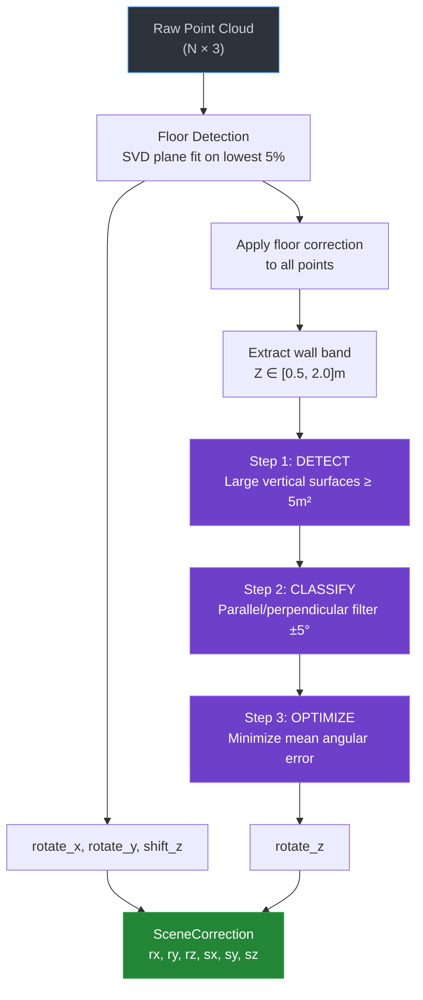
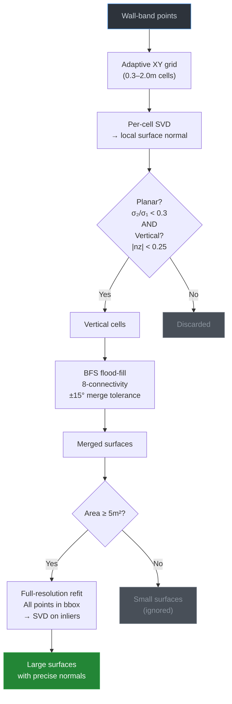
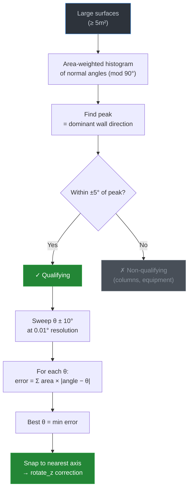

# 🌐 Locul3D — *The Place in 3D*

> A fast, modern 3D point cloud viewer and bounding box annotation editor.
>

<p align="center">
  <strong>View</strong> · <strong>Annotate</strong> · <strong>Explore</strong>
</p>

---

## ✨ Features

| | |
|---|---|
| 🔭 **Real-time 3D Viewer** | Point clouds, meshes, wireframes — rendered with OpenGL |
| 🌐 **360° Panorama Viewer** | Jump into E57 scan panoramas — Leica BLK, NavVis VLX, FARO supported |
| 📦 **3D Annotation Layouts** | Place, move, and resize reference boxes with center+size or min/max corners — toggle between modes with one click |
| 🗂️ **Multi-Layer Scene** | Load point clouds, meshes, and annotations from separate files (PLY, OBJ, E57) into a single scene — control visibility and opacity per layer |
| ✂️ **Scene Clipping** | Inspect scene bounds, hide ceiling with one click, clip to any axis-aligned region — all via GL clip planes (no data copies) |
| 🌗 **Auto Dark/Light Theme** | Follows your OS appearance automatically |
| ⌨️ **Blender-style Shortcuts** | Q/G/R/S for tools, X/Y/Z for axis constraints |
| ↩️ **Undo/Redo** | Full undo stack for annotation work |
| 💾 **JSON/YAML Export** | Save and reload annotations |

---

## 🚀 Quick Start

```bash
# Install dependencies
pip install -r requirements.txt

# Launch viewer
python start.py

# Launch annotation editor
python start.py editor

# Open a file or folder directly
python start.py scan.ply
python start.py folder_with_files_as_layers/
```

---

## 🎮 Controls

### Viewer

| Action | Input |
|--------|-------|
| Orbit camera | Left drag |
| Pan camera | Middle drag / Shift+Left drag |
| Zoom | Scroll / Right drag |
| Fit to scene | `F` |
| Toggle grid | `G` |
| Toggle axes | `A` |
| Open file | `Ctrl+O` |
| Open folder | `Ctrl+Shift+O` |
| Enter 360° panorama | Click **360°** button on panorama layer |
| Exit panorama | `Esc` |
| Panorama opacity | Drag opacity slider while inside |

### Editor (all viewer controls plus)

| Action | Input |
|--------|-------|
| Place new bbox | `Ctrl+Click` |
| Select tool | `Q` |
| Move tool | `G` |
| Rotate tool | `R` |
| Scale tool | `S` |
| Axis constraint | `X` / `Y` / `Z` |
| Delete bbox | `Delete` |
| Undo | `Ctrl+Z` |
| Duplicate | `Ctrl+D` |
| Center/Corners toggle | **Center** button in BBox panel |
| Scene dialog | **Scene** toolbar button |
| Hide ceiling | **Scene** → **Hide Ceiling** |

---

## 📦 Project File

Locul3D uses a single **YAML project file** that combines scene correction, bounding box annotations, reference planes, and metadata. The file is **optional** and **auto-loaded** when placed next to the scene file:

```
google_test.e57          ← scene file (E57, PLY, OBJ)
google_test.e57.yaml     ← project file (auto-loaded on open)
```

The naming convention is `<scene_filename>.yaml` (the full scene filename including its extension, plus `.yaml`).

### Complete Schema

```yaml
# ─── Scene Correction ──────────────────────────────────────
# Rotation (degrees) and shift (scene units) applied as a GL
# transform to align the raw scan to world axes.
# The floor should end up at Z=0, walls parallel to X/Y.
correction:
  rotate_x: -90.0       # tilt correction (floor leveling)
  rotate_y: 0.0         # tilt correction
  rotate_z: 13.21       # wall alignment (rotate to axis)
  shift_x: 0.0          # horizontal offset
  shift_y: 0.0          # horizontal offset
  shift_z: -1.2         # vertical offset (floor → Z=0)

# ─── Default Sizes ─────────────────────────────────────────
# Template sizes [x, y, z] for newly placed annotations.
default_column_size: [0.8, 0.6, 2.5]
default_box_size: [0.8, 0.6, 0.4]

# ─── BBox Annotations ─────────────────────────────────────
# Each bbox can use center+size OR min+max format (per item).
# A single file can mix both formats.
bboxes:
- label: mts_column             # annotation category
  center: [1.0, 2.0, 1.5]      # center position [x, y, z]
  size: [0.8, 0.6, 3.0]        # full extent [sx, sy, sz]
  color: [1.0, 0.5, 0.0]       # RGB [0..1]
  rotation_z: 15.0              # optional, degrees around Z
  fill_opacity: 0.0             # optional, 0=wireframe, 0..1=filled

- label: search_region
  min: [-6.6, -14.2, 0.0]      # min corner [x, y, z]
  max: [2.9, -3.4, 5.2]        # max corner [x, y, z]
  color: [0.0, 0.8, 1.0]
  fill_opacity: 0.09

# ─── Surface Planes ───────────────────────────────────────
# Reference planes for measurements and analysis.
planes:
- axis: z                       # plane normal axis (x, y, or z)
  offset: 0.0                   # position along that axis
  color: [0.5, 0.5, 0.5]
  label: floor

# ─── Reference Point ──────────────────────────────────────
# A single coordinate reference for measurements.
reference_point: [1.0, 2.0, 3.0]
```

All sections are optional. You can start with an empty file and build up.

### How It Works

1. **On scene open** — Locul3D searches for `<scene>.yaml` next to the loaded file
2. **Correction** is applied as a GL transform (all layers see the same corrected space)
3. **Annotations** (bboxes, planes) reference the corrected coordinate system
4. **On save** — the current correction, annotations, and planes are written back to the same file

The grid, axes, and ground plane are drawn in **absolute world coordinates** — they do not move with the scene correction. This lets you visually verify that the floor sits at Z=0 and walls align with grid lines.

---

## 🔧 Scene Correction

Scene correction aligns raw scan data to world axes via rotation and shift transforms. The goal is **floor at Z=0, walls parallel to X and Y axes**.

### Auto-Detect Algorithm

The **⚡ Auto-Detect** button runs a multi-step analysis on the loaded point cloud.

#### High-Level Pipeline



#### Step 1 — Surface Detection Detail



#### Steps 2 & 3 — Classification and Optimization



#### Debug Visualization

When auto-detect runs, the viewport shows diagnostic overlays:

| Overlay | Meaning |
|---------|---------|
| 🟢 Bright green quads | **Qualifying** surfaces (used for angle computation) |
| 🟠 Dim orange quads | Large but **non-qualifying** surfaces |
| Green arrows | Surface normals (top 20 surfaces by point count) |
| 🔵 Blue `+` grid (Z=0) | **Target** axis-aligned world coordinates — walls align to these after correction |
| 🟣 Magenta `+` cross (Z=0) | **Original** detected wall direction before correction was applied |

##### Fiducial Marker Coordinate Spaces

The fiducial markers are drawn in **true world coordinates**, independent of the GL scene correction transform. Since the GL modelview matrix includes `rotate_z` (the wall alignment correction), the marker drawing code counter-rotates via `glRotatef(-rotate_z, 0, 0, 1)` inside a `glPushMatrix/glPopMatrix` pair. This ensures:

- **Blue grid** (`angle_deg=0°`): Arms along pure X and Y — always parallel to the ground plane grid
- **Magenta cross** (`angle_deg=-wall_correction_deg`): Tilted to show where walls were before correction

Both markers are rendered via reusable helper methods:

| Method | Purpose |
|--------|---------|
| `_draw_fiducial_grid(cx, cy, cz, angle_deg, extent, spacing, arm_len, color, line_width)` | Grid of small rotated crosses within a bounding area |
| `_draw_fiducial_cross(cx, cy, cz, angle_deg, arm_len, color, line_width)` | Single large rotated cross at a point |

Overlays clear automatically when the correction dialog is closed.

#### Console Output Example

```
── Auto-detect (3,084,655 points) ──
  Step 1 — Floor: 154,233 pts (bottom 5.0%)
    normal=[-0.0007, 0.0004, 1.0000]
    → rx=-0.0225°, ry=-0.0414°, sz=0.0129
  Step 2 — Walls: Z=[0.5, 2.0]m, min area=5.0m², tolerance=±5.0°
    Cells: 971 vertical / 3589 total
    Surfaces: 326 merged → 10 large (≥5.0m²) → 6 qualifying (±5.0°)
    [✓] 9.7m² (19 cells, 3,927 pts), angle=87.57° (mod 90°)
    [✓] 8.1m² (22 cells, 3,541 pts), angle=87.13° (mod 90°)
    [✗] 6.5m² (24 cells, 1,163 pts), angle=76.59° (mod 90°)
    [✗] 5.9m² (16 cells, 823 pts),  angle=37.08° (mod 90°)
    Peak: 87.57° (mod 90°)
    → rz=2.4300°
```

#### Parameters

| Parameter | Default | Description |
|-----------|---------|-------------|
| `floor_percentile` | 5.0 | Bottom % of Z values for floor plane fit |
| `wall_band_min` | 0.5 m | Min height above floor for wall sampling |
| `wall_band_max` | 2.0 m | Max height above floor for wall sampling |
| `min_surface_area` | 5.0 m² | Minimum area to consider as a wall |
| `angle_tolerance` | 5.0° | Max deviation from dominant direction |

### Manual Adjustment

- **Scene Correction dialog** (non-modal) — spinners update the viewport in real-time
- **Reset** — restores the correction from when the dialog was opened
- **Zero** — clears all correction values (identity transform)

### CLI Overrides

```bash
python start.py scan.e57 --rotate-x -90 --shift-z -1.2
```

All six axes: `--rotate-x`, `--rotate-y`, `--rotate-z`, `--shift-x`, `--shift-y`, `--shift-z`. CLI values override project file values.

---

## ✂️ Scene Clipping

The **Scene** toolbar button (available in both Viewer and Editor) opens a non-modal dialog for inspecting and clipping the scene.

### Scene Dialog

- **Scene Bounds** — Shows X, Y, Z min/max and span in metres. Values update the viewport clip planes in real-time.
- **Hide Ceiling** — One-click ceiling removal using auto-detected ceiling height (Z-histogram peak analysis, clips 0.3m below).
- **Reset** — Removes all clipping and restores the full scene.

Clipping uses OpenGL clip planes — **no point data is copied or modified**.

---

## 📐 BBox Annotations

### Coordinate Modes

Each bbox independently stores coordinates in **center+size** or **min+max** format, toggled via the **Center/Corners** button:

| Mode | Stored as | Panel shows |
|------|-----------|-------------|
| **Center** (default) | `center` + `size` | Center X/Y/Z + Size X/Y/Z |
| **Corners** | `min` + `max` | Min Corner X/Y/Z + Max Corner X/Y/Z |

The mode is preserved per-bbox — a single file can mix both formats.

### Fill Surfaces

Use the **Fill** slider (0–100%) to render translucent filled faces. Saved as `fill_opacity` in the project file.

### Gizmo Interaction

- **Move arrows** — drag along axis to translate
- **Scale handles** — drag face handles to resize
  - *Center mode* — symmetric resize from center
  - *Corners mode* — one face moves, opposite face stays fixed
- **Rotation ring** — drag to rotate around Z axis
- Scale handles take priority over move arrows to prevent accidental activation

---

## 📦 Installation

### Requirements

- Python 3.11+
- PySide6, PyOpenGL, NumPy, Open3D, SciPy, pye57, Pillow

```bash
pip install -r requirements.txt
```

### Package Install (editable)

```bash
pip install -e .
```

Then use anywhere:

```bash
python -m locul3d               # viewer (default)
python -m locul3d editor        # annotation editor
locul3d-viewer                  # viewer via entry point
locul3d-editor                  # editor via entry point
```

---

## 🏗️ Architecture

```
locul3d/
├── start.py          ← Launch here
├── src/locul3d/      ← Python package
│   ├── viewer/       ← 3D viewer application
│   ├── editor/       ← BBox annotation editor
│   ├── analysis/     ← Scene analysis (ceiling, correction auto-detect)
│   ├── rendering/
│   │   ├── gl/       ← OpenGL viewport
│   │   └── panorama/ ← 360° panorama (extractor, sphere, camera)
│   ├── core/         ← Data models (geometry, correction, layers)
│   ├── ui/           ← Panels, dialogs, themes
│   └── plugins/      ← Importers (E57)
└── doc/architecture/ ← Architecture documentation
```

---

## 📄 License

MIT

---

<p align="center">
  <em>Locul3D — from Romanian "locul" (the place) + 3D</em>
</p>
