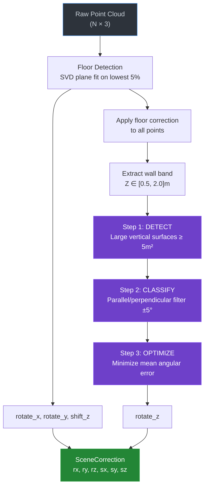
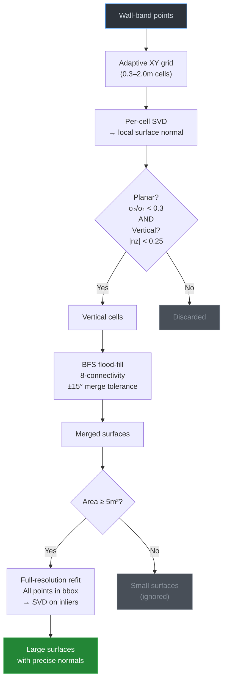
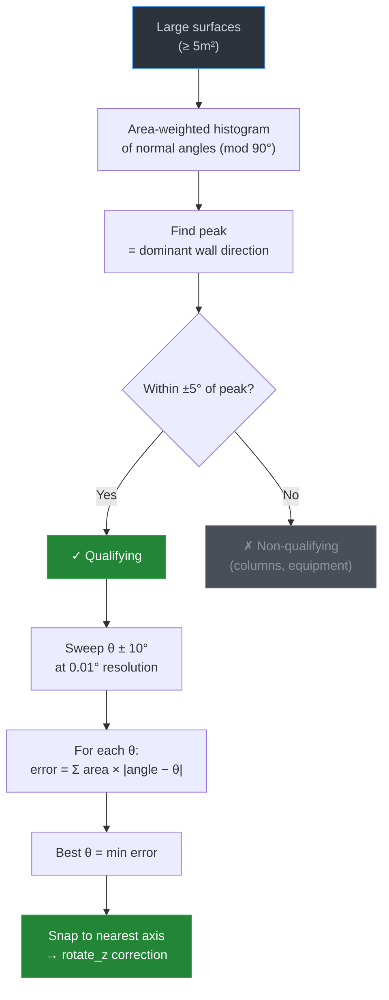

# 🌐 Locul3D — *The Place in 3D*

> A fast, modern 3D point cloud viewer and bounding box annotation editor.
>

<p align="center">
  <strong>View</strong> · <strong>Annotate</strong> · <strong>Explore</strong>
</p>

---

## ✨ Features

| | |
|---|---|
| 🔭 **Real-time 3D Viewer** | Point clouds, meshes, wireframes — rendered with OpenGL |
| 🌐 **360° Panorama Viewer** | Jump into E57 scan panoramas — Leica BLK, NavVis VLX, FARO supported |
| 📦 **3D Annotation Layouts** | Place, move, and resize reference boxes with center+size or min/max corners — toggle between modes with one click |
| 🗂️ **Multi-Layer Scene** | Load point clouds, meshes, and annotations from separate files (PLY, OBJ, E57) into a single scene — control visibility and opacity per layer |
| ✂️ **Scene Clipping** | Inspect scene bounds, hide ceiling with one click, clip to any axis-aligned region — all via GL clip planes (no data copies) |
| 🛰️ **Remote Control API** | REST + WebSocket on `localhost:8350` — scripted camera animation, layer control, point cloud streaming. Available in both viewer and editor. |
| 🎬 **Video Recording** | Capture the viewport to mp4 (H.264 or HEVC) with platform-native HW acceleration (videotoolbox / NVENC / QSV / AMF / VAAPI), software fallback to libx264/libx265, 4K UHD by default |
| 🌫️ **Cone-Shadow Shader Fade** | GLSL 1.20 occluder fade — points between camera and an "area of interest" bounding sphere fade to expose the AoI without dimming the rest of the scene |
| ⏱️ **Adaptive FPS Renderer** | Closed-loop controller throttles realtime FPS based on real GPU paint time (GL_TIME_ELAPSED queries) and slows the animation clock proportionally — slow scenes look smooth instead of jumpy |
| 🌗 **Auto Dark/Light Theme** | Follows your OS appearance automatically |
| ⌨️ **Blender-style Shortcuts** | Q/G/R/S for tools, X/Y/Z for axis constraints |
| ↩️ **Undo/Redo** | Full undo stack for annotation work |
| 💾 **JSON/YAML Export** | Save and reload annotations |

---

## 🚀 Quick Start

```bash
# Install dependencies
pip install -r requirements.txt

# Launch viewer
python start.py

# Launch annotation editor
python start.py editor

# Open a file or folder directly
python start.py scan.ply
python start.py folder_with_files_as_layers/
```

---

## 🎮 Controls

### Viewer

| Action | Input |
|--------|-------|
| Orbit camera | Left drag |
| Pan camera | Middle drag / Shift+Left drag |
| Zoom | Scroll / Right drag |
| Fit to scene | `F` |
| Toggle grid | `G` |
| Toggle axes | `A` |
| Open file | `Ctrl+O` |
| Open folder | `Ctrl+Shift+O` |
| Enter 360° panorama | Click **360°** button on panorama layer |
| Exit panorama | `Esc` |
| Panorama opacity | Drag opacity slider while inside |

### Editor (all viewer controls plus)

| Action | Input |
|--------|-------|
| Place new bbox | `Ctrl+Click` |
| Select tool | `Q` |
| Move tool | `G` |
| Rotate tool | `R` |
| Scale tool | `S` |
| Axis constraint | `X` / `Y` / `Z` |
| Delete bbox | `Delete` |
| Undo | `Ctrl+Z` |
| Duplicate | `Ctrl+D` |
| Center/Corners toggle | **Center** button in BBox panel |
| Scene dialog | **Scene** toolbar button |
| Hide ceiling | **Scene** → **Hide Ceiling** |

---

## 📦 Project File

Locul3D uses a single **YAML project file** that combines scene correction, bounding box annotations, reference planes, and metadata. The file is **optional** and **auto-loaded** when placed next to the scene file:

```
google_test.e57          ← scene file (E57, PLY, OBJ)
google_test.e57.yaml     ← project file (auto-loaded on open)
```

The naming convention is `<scene_filename>.yaml` (the full scene filename including its extension, plus `.yaml`).

### Complete Schema

```yaml
# ─── Scene Correction ──────────────────────────────────────
# Rotation (degrees) and shift (scene units) applied as a GL
# transform to align the raw scan to world axes.
# The floor should end up at Z=0, walls parallel to X/Y.
correction:
  rotate_x: -90.0       # tilt correction (floor leveling)
  rotate_y: 0.0         # tilt correction
  rotate_z: 13.21       # wall alignment (rotate to axis)
  shift_x: 0.0          # horizontal offset
  shift_y: 0.0          # horizontal offset
  shift_z: -1.2         # vertical offset (floor → Z=0)

# ─── Default Sizes ─────────────────────────────────────────
# Template sizes [x, y, z] for newly placed annotations.
default_column_size: [0.8, 0.6, 2.5]
default_box_size: [0.8, 0.6, 0.4]

# ─── BBox Annotations ─────────────────────────────────────
# Each bbox can use center+size OR min+max format (per item).
# A single file can mix both formats.
bboxes:
- label: mts_column             # annotation category
  center: [1.0, 2.0, 1.5]      # center position [x, y, z]
  size: [0.8, 0.6, 3.0]        # full extent [sx, sy, sz]
  color: [1.0, 0.5, 0.0]       # RGB [0..1]
  rotation_z: 15.0              # optional, degrees around Z
  fill_opacity: 0.0             # optional, 0=wireframe, 0..1=filled

- label: search_region
  min: [-6.6, -14.2, 0.0]      # min corner [x, y, z]
  max: [2.9, -3.4, 5.2]        # max corner [x, y, z]
  color: [0.0, 0.8, 1.0]
  fill_opacity: 0.09

# ─── Surface Planes ───────────────────────────────────────
# Reference planes for measurements and analysis.
planes:
- axis: z                       # plane normal axis (x, y, or z)
  offset: 0.0                   # position along that axis
  color: [0.5, 0.5, 0.5]
  label: floor

# ─── Reference Point ──────────────────────────────────────
# A single coordinate reference for measurements.
reference_point: [1.0, 2.0, 3.0]
```

All sections are optional. You can start with an empty file and build up.

### How It Works

1. **On scene open** — Locul3D searches for `<scene>.yaml` next to the loaded file
2. **Correction** is applied as a GL transform (all layers see the same corrected space)
3. **Annotations** (bboxes, planes) reference the corrected coordinate system
4. **On save** — the current correction, annotations, and planes are written back to the same file

The grid, axes, and ground plane are drawn in **absolute world coordinates** — they do not move with the scene correction. This lets you visually verify that the floor sits at Z=0 and walls align with grid lines.

---

## 🔧 Scene Correction

Scene correction aligns raw scan data to world axes via rotation and shift transforms. The goal is **floor at Z=0, walls parallel to X and Y axes**.

### Auto-Detect Algorithm

The **⚡ Auto-Detect** button runs a multi-step analysis on the loaded point cloud.

#### High-Level Pipeline


```mermaid
flowchart TD
    A["Raw Point Cloud<br/>(N × 3)"] --> B["Floor Detection<br/>SVD plane fit on lowest 5%"]
    B --> C["rotate_x, rotate_y, shift_z"]
    B --> D["Apply floor correction<br/>to all points"]
    D --> E["Extract wall band<br/>Z ∈ [0.5, 2.0]m"]
    E --> F["Step 1: DETECT<br/>Large vertical surfaces ≥ 5m²"]
    F --> G["Step 2: CLASSIFY<br/>Parallel/perpendicular filter ±5°"]
    G --> H["Step 3: OPTIMIZE<br/>Minimize mean angular error"]
    H --> I["rotate_z"]
    C --> J["SceneCorrection<br/>rx, ry, rz, sx, sy, sz"]
    I --> J

    style A fill:#2d333b,stroke:#58a6ff,color:#c9d1d9
    style J fill:#238636,stroke:#2ea043,color:#fff
    style F fill:#6e40c9,stroke:#8b5cf6,color:#fff
    style G fill:#6e40c9,stroke:#8b5cf6,color:#fff
    style H fill:#6e40c9,stroke:#8b5cf6,color:#fff
```

#### Step 1 — Surface Detection Detail


```mermaid
flowchart TD
    WB["Wall-band points"] --> GRID["Adaptive XY grid<br/>(0.3–2.0m cells)"]
    GRID --> SVD["Per-cell SVD<br/>→ local surface normal"]
    SVD --> FILT{"Planar?<br/>σ₂/σ₁ < 0.3<br/>AND<br/>Vertical?<br/>|nz| < 0.25"}
    FILT -->|Yes| CELLS["Vertical cells"]
    FILT -->|No| SKIP["Discarded"]
    CELLS --> BFS["BFS flood-fill<br/>8-connectivity<br/>±15° merge tolerance"]
    BFS --> SURF["Merged surfaces"]
    SURF --> AREA{"Area ≥ 5m²?"}
    AREA -->|Yes| REFINE["Full-resolution refit<br/>All points in bbox<br/>→ SVD on inliers"]
    AREA -->|No| SMALL["Small surfaces<br/>(ignored)"]
    REFINE --> LARGE["Large surfaces<br/>with precise normals"]

    style WB fill:#2d333b,stroke:#58a6ff,color:#c9d1d9
    style LARGE fill:#238636,stroke:#2ea043,color:#fff
    style SMALL fill:#484f58,stroke:#6e7681,color:#8b949e
    style SKIP fill:#484f58,stroke:#6e7681,color:#8b949e
```

#### Steps 2 & 3 — Classification and Optimization


```mermaid
flowchart TD
    LS["Large surfaces<br/>(≥ 5m²)"] --> HIST["Area-weighted histogram<br/>of normal angles (mod 90°)"]
    HIST --> PEAK["Find peak<br/>= dominant wall direction"]
    PEAK --> CLASS{"Within ±5° of peak?"}
    CLASS -->|Yes| Q["✓ Qualifying"]
    CLASS -->|No| NQ["✗ Non-qualifying<br/>(columns, equipment)"]
    Q --> SWEEP["Sweep θ ± 10°<br/>at 0.01° resolution"]
    SWEEP --> ERR["For each θ:<br/>error = Σ area × |angle − θ|"]
    ERR --> MIN["Best θ = min error"]
    MIN --> SNAP["Snap to nearest axis<br/>→ rotate_z correction"]

    style LS fill:#2d333b,stroke:#58a6ff,color:#c9d1d9
    style Q fill:#238636,stroke:#2ea043,color:#fff
    style NQ fill:#484f58,stroke:#6e7681,color:#8b949e
    style SNAP fill:#238636,stroke:#2ea043,color:#fff
```

#### Debug Visualization

When auto-detect runs, the viewport shows diagnostic overlays:

| Overlay | Meaning |
|---------|---------|
| 🟢 Bright green quads | **Qualifying** surfaces (used for angle computation) |
| 🟠 Dim orange quads | Large but **non-qualifying** surfaces |
| Green arrows | Surface normals (top 20 surfaces by point count) |
| 🔵 Blue `+` grid (Z=0) | **Target** axis-aligned world coordinates — walls align to these after correction |
| 🟣 Magenta `+` cross (Z=0) | **Original** detected wall direction before correction was applied |

##### Fiducial Marker Coordinate Spaces

The fiducial markers are drawn in **true world coordinates**, independent of the GL scene correction transform. Since the GL modelview matrix includes `rotate_z` (the wall alignment correction), the marker drawing code counter-rotates via `glRotatef(-rotate_z, 0, 0, 1)` inside a `glPushMatrix/glPopMatrix` pair. This ensures:

- **Blue grid** (`angle_deg=0°`): Arms along pure X and Y — always parallel to the ground plane grid
- **Magenta cross** (`angle_deg=-wall_correction_deg`): Tilted to show where walls were before correction

Both markers are rendered via reusable helper methods:

| Method | Purpose |
|--------|---------|
| `_draw_fiducial_grid(cx, cy, cz, angle_deg, extent, spacing, arm_len, color, line_width)` | Grid of small rotated crosses within a bounding area |
| `_draw_fiducial_cross(cx, cy, cz, angle_deg, arm_len, color, line_width)` | Single large rotated cross at a point |

Overlays clear automatically when the correction dialog is closed.

#### Console Output Example

```
── Auto-detect (3,084,655 points) ──
  Step 1 — Floor: 154,233 pts (bottom 5.0%)
    normal=[-0.0007, 0.0004, 1.0000]
    → rx=-0.0225°, ry=-0.0414°, sz=0.0129
  Step 2 — Walls: Z=[0.5, 2.0]m, min area=5.0m², tolerance=±5.0°
    Cells: 971 vertical / 3589 total
    Surfaces: 326 merged → 10 large (≥5.0m²) → 6 qualifying (±5.0°)
    [✓] 9.7m² (19 cells, 3,927 pts), angle=87.57° (mod 90°)
    [✓] 8.1m² (22 cells, 3,541 pts), angle=87.13° (mod 90°)
    [✗] 6.5m² (24 cells, 1,163 pts), angle=76.59° (mod 90°)
    [✗] 5.9m² (16 cells, 823 pts),  angle=37.08° (mod 90°)
    Peak: 87.57° (mod 90°)
    → rz=2.4300°
```

#### Parameters

| Parameter | Default | Description |
|-----------|---------|-------------|
| `floor_percentile` | 5.0 | Bottom % of Z values for floor plane fit |
| `wall_band_min` | 0.5 m | Min height above floor for wall sampling |
| `wall_band_max` | 2.0 m | Max height above floor for wall sampling |
| `min_surface_area` | 5.0 m² | Minimum area to consider as a wall |
| `angle_tolerance` | 5.0° | Max deviation from dominant direction |

### Manual Adjustment

- **Scene Correction dialog** (non-modal) — spinners update the viewport in real-time
- **Reset** — restores the correction from when the dialog was opened
- **Zero** — clears all correction values (identity transform)

### CLI Overrides

```bash
python start.py scan.e57 --rotate-x -90 --shift-z -1.2
```

All six axes: `--rotate-x`, `--rotate-y`, `--rotate-z`, `--shift-x`, `--shift-y`, `--shift-z`. CLI values override project file values.

---

## ✂️ Scene Clipping

The **Scene** toolbar button (available in both Viewer and Editor) opens a non-modal dialog for inspecting and clipping the scene.

### Scene Dialog

- **Scene Bounds** — Shows X, Y, Z min/max and span in metres. Values update the viewport clip planes in real-time.
- **Hide Ceiling** — One-click ceiling removal using auto-detected ceiling height (Z-histogram peak analysis, clips 0.3m below).
- **Reset** — Removes all clipping and restores the full scene.

Clipping uses OpenGL clip planes — **no point data is copied or modified**.

---

## 🛰️ Remote Control API

Locul3D exposes a REST + WebSocket API on `http://localhost:8350` (default
port) for scripting and automation. The server starts automatically with
both the **viewer** and the **editor** unless `--no-api` is passed.

### CLI flags

| Flag | Default | Description |
|---|---|---|
| `--api-port PORT` | `8350` | TCP port the API server binds to |
| `--api-host HOST` | `127.0.0.1` | Bind address (`0.0.0.0` to expose on the LAN) |
| `--no-api` | _enabled_ | Disable the API server entirely |
| `--vsync` / `--no-vsync` | `--no-vsync` | OpenGL swap interval. Vsync OFF lets the adaptive FPS controller see real GPU paint timings; ON caps everything at the display refresh |

### Endpoints (selection)

| Method | Path | Description |
|---|---|---|
| `GET` | `/api/v1/system/ping` | Liveness check |
| `GET` | `/api/v1/openapi.json` | OpenAPI 3.1 schema |
| `GET` / `PUT` | `/api/v1/camera` | Read or set the orbit camera state |
| `POST` | `/api/v1/camera/look_at` | Aim camera at a 3D point |
| `GET` / `PUT` / `DELETE` | `/api/v1/viewport/clip` | AABB scene clipping |
| `GET` / `PUT` | `/api/v1/viewport/fade` | Cone-shadow shader fade — see below |
| `GET` / `PUT` | `/api/v1/viewport` | Render settings (`point_size`, `show_grid`, `show_axes`, `bg_color`, `vsync`, …) |
| `GET` / `POST` / `PUT` / `DELETE` | `/api/v1/shapes/bboxes` | Editor bbox annotations |
| `POST` | `/api/v1/recording/start` | Start video recording — see below |
| `POST` | `/api/v1/recording/pause` / `/resume` / `/stop` | Pause / resume / finalize |
| `GET` | `/api/v1/recording/status` | Live recording state, frames written, bytes |
| `GET` | `/api/v1/recording/encoders` | Probe ffmpeg + report HW/SW encoder picks |

### WebSocket commands

The WebSocket at `ws://localhost:8350/ws` accepts JSON messages of the
form `{"type": "...", ...payload}`. Most commands are documented in
[`doc/architecture/remote-control-api.md`](doc/architecture/remote-control-api.md);
the new ones added for animation playback control are:

| Type | Payload | Description |
|---|---|---|
| `camera.transform_continuous` | `track_id`, `property` (`azimuth`/`elevation`/`distance`/`fov`), `rate`, optional `duration_ms` | Continuous camera motion. Pass `track_id` (the bare `id` field is consumed by the WS layer as a request-correlation id). |
| `transform.stop` | `track_id` | Stop one named track |
| `transform.stop_all` | _(none)_ | Stop everything |
| `animation.set_realtime_fps` | `fps` (ceiling), `min_fps`, `adaptive` | Tune the adaptive FPS controller |
| `animation.get_realtime_fps` | _(none)_ | Returns `effective_fps`, `paint_peak_ms`, `paint_p80_ms`, `time_scale_active`, … |
| `animation.set_preview_mode` | `enable`, `target_fps` | Hold target FPS by adapting LOD instead of dropping FPS |
| `animation.set_time_scale` | `auto`, `nominal_fps`, `scale` | Slow the virtual animation clock when paint cost forces FPS below `nominal_fps` |

### Cone-shadow Shader Fade

`PUT /api/v1/viewport/fade` enables a GLSL 1.20 occluder fade for point
layers. The fade is a **true cone** swept from the camera through the
"area of interest" bounding sphere — only points that lie *between* the
camera and the AoI are dimmed; points off to the side or behind the AoI
keep their full alpha.

```json
{
  "enable": true,
  "alpha_mul": 0.4,
  "band": 0.8,
  "aoi_center": [-1.5, -8.8, 2.8],
  "aoi_radius": 7.5
}
```

| Field | Description |
|---|---|
| `enable` | Bool. Disables fall back to fixed-function rendering when `false`. |
| `alpha_mul` | Alpha multiplier for occluding points (0..1; 0 = invisible, 1 = no fade). |
| `band` | Smoothstep half-band around the AoI's near edge, in world units. |
| `aoi_center` | World-space center of the area of interest (3 floats). |
| `aoi_radius` | Bounding-sphere radius in world units. |

The vertex/fragment shaders are **OpenGL 2.1 compatibility-profile
GLSL 1.20** — same profile the rest of the renderer uses, no GL upgrade
required. If shader compilation fails on the driver, the renderer
silently falls back to the fixed-function path.

### Animation Demo

```bash
# Start the editor (annotations live there):
python start.py editor scan.e57

# In a second terminal — orbit the camera around the scene's
# `search_region` bbox annotation, with cone-shadow fade:
python scripts/demo_flyover_search_area.py --fade

# Stop it:
python scripts/demo_flyover_search_area.py --stop
```

Full flag reference:

| Flag | Default | Description |
|---|---|---|
| `--duration N` | `15` | Seconds for one full 360° revolution |
| `--elevation N` | `25` | Camera elevation angle in degrees |
| `--margin N` | `1.6` | Distance multiplier on the bbox bounding sphere |
| `--fov N` | _viewer_ | Override camera FOV |
| `--clip {none,z,box}` | `z` | Scene clipping. `z` removes ceiling/floor outside the bbox. `box` clips horizontally too. |
| `--fade` | _off_ | Enable cone-shadow shader fade through the search bbox |
| `--fade-mul N` | `0.4` | Alpha multiplier for occluders |
| `--fade-band N` | `0.8` | Smoothstep half-band (m) |
| `--max-fps N` | `125` | Realtime FPS ceiling for the adaptive controller |
| `--min-fps N` | `1` | Realtime FPS floor |
| `--no-adaptive` | _adaptive_ | Disable closed-loop FPS control |
| `--preview` | _off_ | Hold target FPS, adapt LOD instead of dropping FPS |
| `--preview-fps N` | `60` | Target FPS for `--preview` |
| `--no-time-scale` | _auto_ | Disable virtual-clock slowdown |
| `--nominal-fps N` | `60` | Frame rate the animation is *authored* for |
| `--stop` | — | Stop a running flyover and exit |

---

## 🎬 Video Recording

Locul3D records the GL viewport to an mp4 file using `ffmpeg` with
**platform-native HW encoding** wherever possible:

| Platform | H.264 priority | HEVC priority |
|---|---|---|
| macOS | `h264_videotoolbox` | `hevc_videotoolbox` |
| Windows | `h264_nvenc`, `h264_qsv`, `h264_amf` | `hevc_nvenc`, `hevc_qsv`, `hevc_amf` |
| Linux | `h264_nvenc`, `h264_vaapi`, `h264_qsv` | `hevc_nvenc`, `hevc_vaapi`, `hevc_qsv` |
| _Software fallback_ | `libx264` | `libx265` |

### Requirements

`ffmpeg` must be on `PATH` (or set `LOCUL3D_FFMPEG=/path/to/ffmpeg`).

```bash
brew install ffmpeg          # macOS
apt install ffmpeg           # Debian/Ubuntu
choco install ffmpeg         # Windows
```

### Quick reference

```bash
# Default — current viewport size, 60 fps, HEVC HW (videotoolbox on Mac):
python scripts/demo_flyover_search_area.py --fade --record fly.mp4

# 4K UHD HEVC, force HW encoder:
python scripts/demo_flyover_search_area.py --fade --record fly_4k.mp4 \
       --rec-resolution 4k --rec-codec hevc --rec-hw hw

# 1080p H.264 software (libx264) for portability:
python scripts/demo_flyover_search_area.py --fade --record fly_sw.mp4 \
       --rec-resolution 1080p --rec-codec h264 --rec-hw sw

# Clean look — force grid/axes off, white background:
python scripts/demo_flyover_search_area.py --fade --record fly_clean.mp4 \
       --rec-grid off --rec-axes off --rec-bg 1,1,1
```

### Recording flags

| Flag | Default | Description |
|---|---|---|
| `--record PATH` | _none_ | Record the flyover. Relative paths are placed under `<repo>/video/`. |
| `--rec-resolution {viewport,4k,1080p,720p,...}` | `viewport` | Output resolution. `viewport` uses the live editor widget size (HiDPI-aware), rounded to even. |
| `--rec-fps N` | `60` | Output frame rate |
| `--rec-codec {hevc,h264}` | `hevc` | Codec. HEVC files get the `hvc1` tag for QuickTime / Photos / iOS compatibility. |
| `--rec-hw {auto,hw,sw}` | `auto` | Encoder selection. `hw` errors out if no HW encoder is available; `sw` forces libx264/libx265. |
| `--rec-bitrate KBPS` | _auto_ | Override the default bitrate (auto-derived from resolution × fps) |
| `--rec-grid {inherit,on,off}` | `inherit` | Grid in the video. `inherit` follows the viewer's current setting. |
| `--rec-axes {inherit,on,off}` | `inherit` | Axes in the video |
| `--rec-bg R,G,B` | _viewer theme_ | Force background color for the recording (3 or 4 floats 0..1). Restored to the viewer theme on stop. |

### REST recording API

```bash
# Start (defaults: viewport size, 60 fps, HEVC, HW auto, file under <repo>/video/):
curl -X POST http://localhost:8350/api/v1/recording/start \
     -H 'content-type: application/json' \
     -d '{"path":"manual.mp4","resolution":"4k","fps":60,"codec":"hevc"}'

# Pause / resume — same file stays open:
curl -X POST http://localhost:8350/api/v1/recording/pause
curl -X POST http://localhost:8350/api/v1/recording/resume

# Stop and finalize:
curl -X POST http://localhost:8350/api/v1/recording/stop

# Live status:
curl    http://localhost:8350/api/v1/recording/status

# Encoder probe — what HW/SW selections will the server make?
curl    http://localhost:8350/api/v1/recording/encoders | python3 -m json.tool
```

`POST /recording/start` body fields:

| Field | Default | Description |
|---|---|---|
| `path` | `<repo>/video/locul3d_<ts>.mp4` | Output file. Relative paths resolved under `<repo>/video/`. |
| `width`, `height` | from `resolution` | Explicit dimensions (rounded to even) |
| `resolution` | `viewport` | Preset (`viewport`, `4k`, `1080p`, `720p`) |
| `fps` | `60` | Output frame rate |
| `codec` | `hevc` | `hevc` or `h264` (aliases: `h265`, `avc`, `x264`, `x265` accepted) |
| `hw` | `auto` | `auto` / `hw` / `sw` |
| `bitrate_kbps` | auto | Override bitrate (default: ~7.5 Mbps/Mpx-30s for HEVC) |
| `grid` | `null` (inherit) | `true` / `false` to override the viewer's `show_grid` for the recording |
| `axes` | `null` (inherit) | Same for `show_axes` |
| `bg_color` | `null` (inherit) | `[r,g,b]` or `[r,g,b,a]` floats 0..1; restored on stop |

### Behavior notes

- **Deterministic capture** — the animation engine advances its virtual clock by exactly `1/fps` per frame, independent of wall-clock time. The video is frame-perfect even if the GPU + encoder are slower than realtime.
- **UI is locked** for the duration: mouse, keyboard, toolbars, panels, menus. The viewport keeps repainting so the operator can watch the recording happen in real time. Re-enabled automatically on `stop`, abort, or natural completion.
- **Backpressure** — a 4-frame bounded queue between the engine and the ffmpeg writer thread throttles the render loop to encoder speed. No frames are silently dropped unless the encoder stalls completely.
- **Failure on HW request** — `--rec-hw hw` (or `"hw":"hw"` via REST) errors out if no HW encoder is available; the recording is not started. Per design: deterministic failures over silent fallback.
- **HEVC + QuickTime** — HEVC outputs are tagged `hvc1` (not the libavformat default `hev1`) so QuickTime / Photos / iOS can play them. Other players accept both.
- **Default folder** — files default to `<repo>/video/` (auto-created). Override per recording with an absolute path.

---

## 📐 BBox Annotations

### Coordinate Modes

Each bbox independently stores coordinates in **center+size** or **min+max** format, toggled via the **Center/Corners** button:

| Mode | Stored as | Panel shows |
|------|-----------|-------------|
| **Center** (default) | `center` + `size` | Center X/Y/Z + Size X/Y/Z |
| **Corners** | `min` + `max` | Min Corner X/Y/Z + Max Corner X/Y/Z |

The mode is preserved per-bbox — a single file can mix both formats.

### Fill Surfaces

Use the **Fill** slider (0–100%) to render translucent filled faces. Saved as `fill_opacity` in the project file.

### Gizmo Interaction

- **Move arrows** — drag along axis to translate
- **Scale handles** — drag face handles to resize
  - *Center mode* — symmetric resize from center
  - *Corners mode* — one face moves, opposite face stays fixed
- **Rotation ring** — drag to rotate around Z axis
- Scale handles take priority over move arrows to prevent accidental activation

---

## 📦 Installation

### Requirements

- Python 3.11+
- PySide6, PyOpenGL, NumPy, Open3D, SciPy, pye57, Pillow

```bash
pip install -r requirements.txt
```

### Package Install (editable)

```bash
pip install -e .
```

Then use anywhere:

```bash
python -m locul3d               # viewer (default)
python -m locul3d editor        # annotation editor
locul3d-viewer                  # viewer via entry point
locul3d-editor                  # editor via entry point
```

---

## 🏗️ Architecture

```
locul3d/
├── start.py          ← Launch here
├── src/locul3d/      ← Python package
│   ├── viewer/       ← 3D viewer application
│   ├── editor/       ← BBox annotation editor
│   ├── analysis/     ← Scene analysis (ceiling, correction auto-detect)
│   ├── rendering/
│   │   ├── gl/       ← OpenGL viewport
│   │   └── panorama/ ← 360° panorama (extractor, sphere, camera)
│   ├── core/         ← Data models (geometry, correction, layers)
│   ├── ui/           ← Panels, dialogs, themes
│   └── plugins/      ← Importers (E57)
└── doc/architecture/ ← Architecture documentation
```

---

## 📄 License

MIT

---

<p align="center">
  <em>Locul3D — from Romanian "locul" (the place) + 3D</em>
</p>
