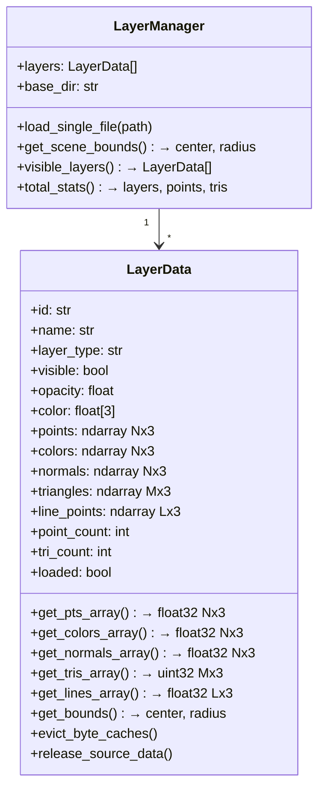
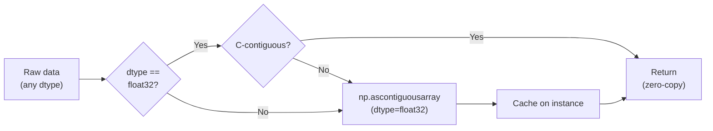
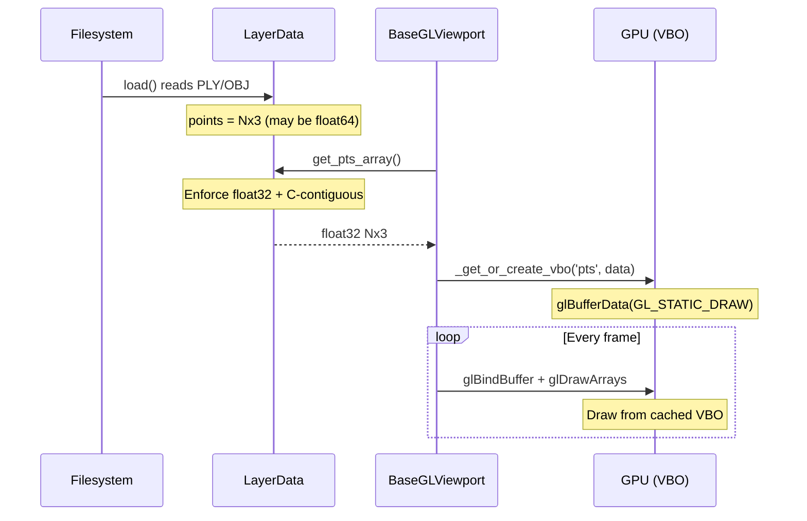

# Data Model

> Layer types, data accessors, and memory management in Locul3D.

## Layer Data Model



## Layer Types

| Type | Geometry | Rendering Method | Example |
|---|---|---|---|
| `pointcloud` | `points` Nx3 | `glDrawArrays(GL_POINTS)` | Scanned points |
| `mesh` | `points` + `triangles` | `glDrawElements(GL_TRIANGLES)` | Reconstructed surfaces |
| `wireframe` | `line_points` Lx3 | `glDrawArrays(GL_LINES)` | Oriented bounding boxes |
| `panorama` | Position + image data | Special marker rendering | 360° scan images |

## Data Safety: dtype Enforcement

All `get_*_array()` methods enforce OpenGL-compatible formats:



This is critical because:
- **E57 files** load as `float64` by default
- **OpenGL** expects `GL_FLOAT` (32-bit) in `glVertexPointer`
- Sending `float64` to a 32-bit pointer causes the GPU to read **2× past the buffer** → SIGSEGV

## Data Flow: Load → Render



## Memory Management

### Cache Hierarchy

```
LayerData
  ├── Source arrays (points, colors, normals, triangles)
  │     Always in memory while layer is loaded
  │
  ├── Byte caches (_pts_bytes, _rgba_bytes, etc.)
  │     Evicted via evict_byte_caches() when layer hidden
  │
  └── GPU VBOs (managed by BaseGLViewport._vbos dict)
        Freed via delete_vbos_for_layer() when layer hidden
        Freed via delete_all_vbos() on file load
```

### Eviction Strategy

| Event | Action |
|---|---|
| Layer hidden | `evict_byte_caches()` + `delete_vbos_for_layer()` |
| New file loaded | `delete_all_vbos()` |
| Layer deleted | `release_source_data()` + `delete_vbos_for_layer()` |

## File Reference

| File | Contents |
|---|---|
| [`core/layer.py`](../../src/locul3d/core/layer.py) | `LayerData`, `LayerManager` |
| [`core/constants.py`](../../src/locul3d/core/constants.py) | `COLORS`, `LAYER_GROUPS`, `DEFAULT_SIZES` |
