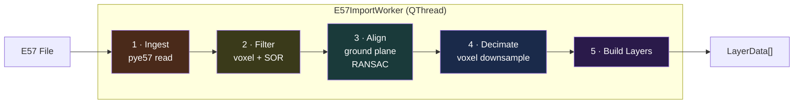
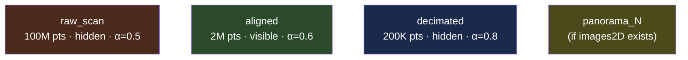
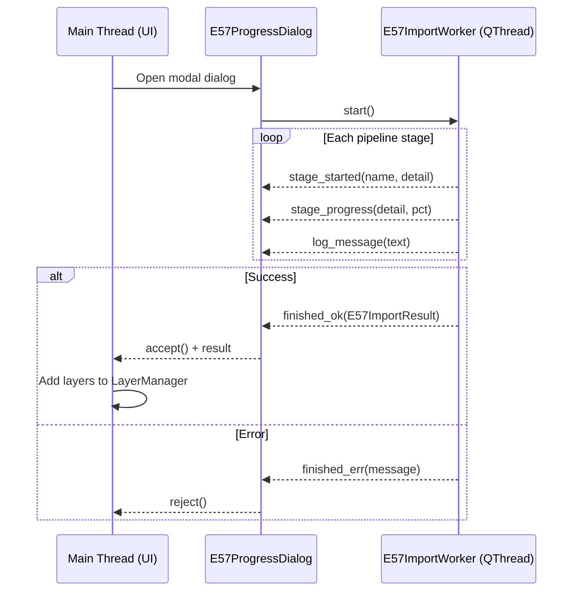

# E57 Import Pipeline

> How raw E57 scanner data is ingested, processed, and turned into renderable layers.

## Pipeline Overview

E57 import runs on a background `QThread` (`E57ImportWorker`) with a modal progress dialog. The pipeline produces multiple `LayerData` objects with different processing levels.



## Stage Details

### Stage 1: Ingest

- Read scan data via `pye57` (cartesianX/Y/Z + color/intensity)
- Optional crop to `E57_CROP_RADIUS` meters around scanner position
- Snapshot raw arrays as `float32` for the `raw_scan` layer
- Output: Open3D `PointCloud` + raw numpy arrays + metadata dict

### Stage 2: Filter

```
Input → Voxel downsample (E57_VOXEL_SIZE_FILTER mm) → Statistical Outlier Removal → Output
```

- `E57_VOXEL_SIZE_FILTER`: controls spatial resolution after initial cleanup
- SOR parameters: `E57_SOR_K_NEIGHBORS`, `E57_SOR_STD_RATIO`

### Stage 3: Align

1. Find floor points (bottom 20% of Z range)
2. RANSAC plane fitting → extract ground normal
3. Rotate point cloud so ground normal → Z-up
4. Shift Z so floor sits at Z=0
5. Validate with floor RMSE check

### Stage 4: Decimate

- Final voxel downsample at `E57_VOXEL_SIZE_MESH` for display-ready density
- Produces the `decimated` layer

### Stage 5: Build Layers



| Layer | Source | Visible | Opacity | Purpose |
|---|---|---|---|---|
| `raw_scan` | Raw E57 arrays | **No** | 0.5 | Full-resolution reference (hidden by default — too large for interactive rendering) |
| `aligned` | Filtered + rotated | **Yes** | 0.6 | Primary display cloud |
| `surface_N` | Per-surface clusters | No | 1.0 | Individual surface analysis |
| `unclassified` | Remainder points | No | 0.3 | Points not belonging to any surface |
| `decimated` | Final downsample | No | 0.8 | Fast preview / mesh generation |
| `panorama_N` | Embedded images | Yes | 1.0 | 360° panoramic views |

## Thread Architecture



## Panorama Extraction

If the E57 contains `images2D` nodes (requires `libe57` + `Pillow`):

1. Iterate all image entries in the E57
2. Read pose (translation + rotation quaternion)
3. Detect representation type (pinhole, spherical, cylindrical)
4. Extract JPEG/PNG blob data
5. Group by position → create panorama layers
6. Support both spherical (equirectangular) and cubemap formats

## File Reference

| File | Purpose |
|---|---|
| [`plugins/importers/e57.py`](../../src/locul3d/plugins/importers/e57.py) | Full pipeline: `E57ImportWorker`, `E57ProgressDialog`, `E57ImportResult` |
| [`editor/window.py`](../../src/locul3d/editor/window.py) | `_import_e57_file()` — orchestrates worker + dialog |
| [`core/layer.py`](../../src/locul3d/core/layer.py) | `LayerData` — destination for pipeline output |
