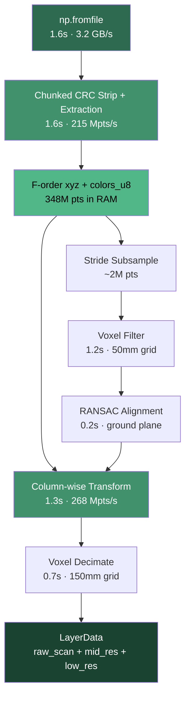
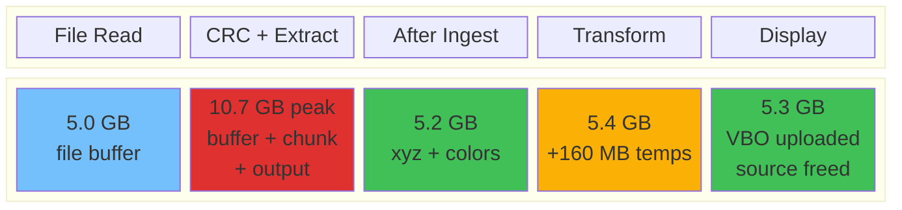
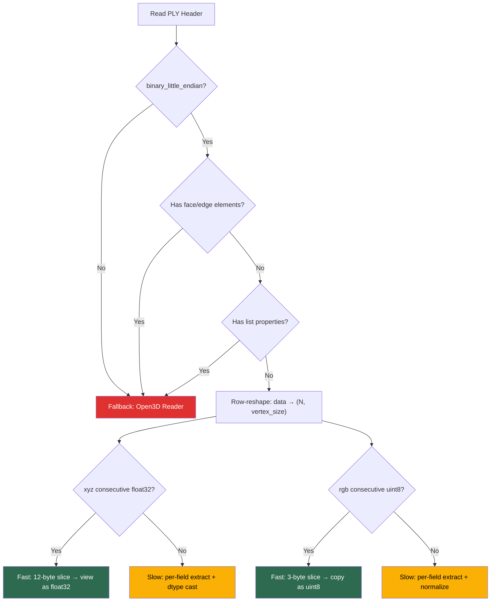
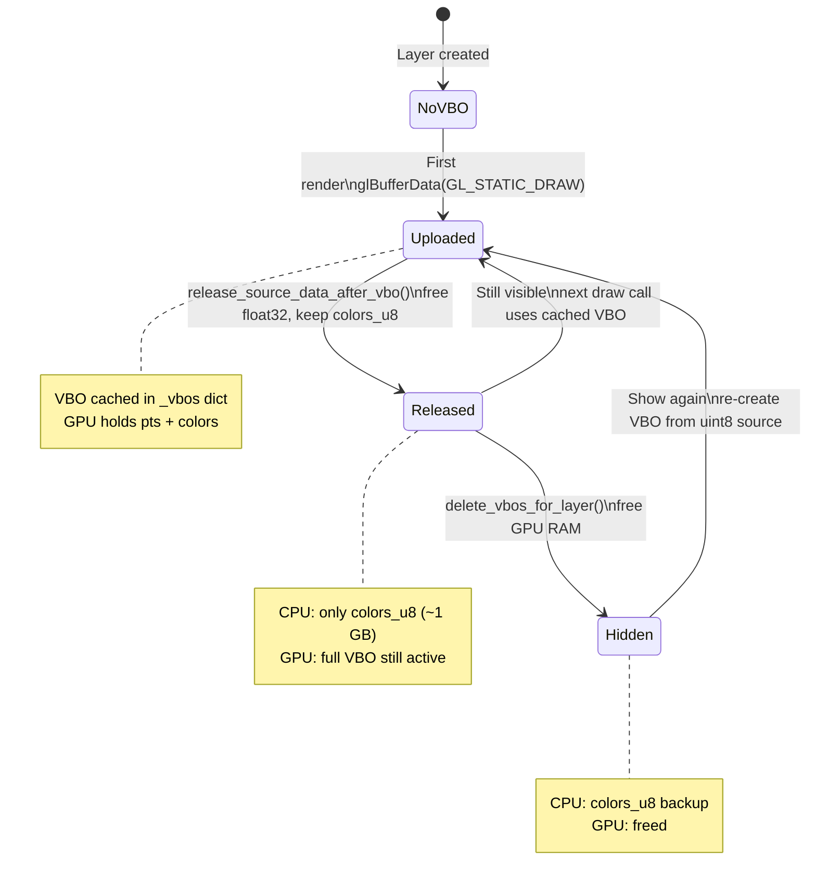

# Loader Performance Architecture

Comprehensive technical documentation of the high-performance file loading
pipelines in Locul3D. Covers E57 and PLY formats, memory management, GPU
upload, and the optimization rationale behind each design choice.

**Benchmark hardware:** Mac M1ARM64, NVMe SSD (~3 GB/s sequential read).
**Benchmark dataset:** 5 GB E57 file, 348M points, 7 fields per packet.

### Glossary

| Abbreviation | Domain | Meaning |
|---|---|---|
| **AABB** | Computational Geometry | Axis-Aligned Bounding Box — the smallest box aligned to X/Y/Z axes that encloses all points in a set. [Wikipedia](https://en.wikipedia.org/wiki/Minimum_bounding_box#Axis-aligned_minimum_bounding_box) |
| **BLAS** | Numerical Computing | Basic Linear Algebra Subprograms — a standardized library of low-level matrix/vector operations (e.g. matrix multiply). NumPy delegates to BLAS for `np.dot`. [Wikipedia](https://en.wikipedia.org/wiki/Basic_Linear_Algebra_Subprograms) |
| **CRC / CRC32C** | Data Integrity | Cyclic Redundancy Check — a checksum algorithm used to detect data corruption. E57 files append a 4-byte CRC32C to every 1020-byte page. [Wikipedia](https://en.wikipedia.org/wiki/Cyclic_redundancy_check) |
| **GIL** | Python Runtime | Global Interpreter Lock — a mutex in CPython that allows only one thread to execute Python bytecode at a time, limiting true parallelism. [Wikipedia](https://en.wikipedia.org/wiki/Global_interpreter_lock) |
| **k-NN** | Machine Learning | k-Nearest Neighbors — an algorithm that finds the k closest points to each query point, typically using a spatial index (k-d tree). [Wikipedia](https://en.wikipedia.org/wiki/K-nearest_neighbors_algorithm) |
| **LLC** | Computer Architecture | Last Level Cache — the largest and slowest CPU cache (typically L3), shared across all cores. Data that fits in LLC avoids slow main-memory accesses. [Wikipedia](https://en.wikipedia.org/wiki/CPU_cache#Multi-level_caches) |
| **LOD** | Computer Graphics | Level of Detail — rendering technique that reduces geometric complexity (fewer points) when full detail is not needed, e.g. during camera motion. [Wikipedia](https://en.wikipedia.org/wiki/Level_of_detail_(computer_graphics)) |
| **NVMe** | Storage Hardware | Non-Volatile Memory Express — a high-speed storage protocol for SSDs connected directly to the CPU via PCIe, enabling multi-GB/s throughput. [Wikipedia](https://en.wikipedia.org/wiki/NVM_Express) |
| **RANSAC** | Computer Vision | Random Sample Consensus — a robust iterative algorithm that fits a model (e.g. a ground plane) to data while ignoring outliers. [Wikipedia](https://en.wikipedia.org/wiki/Random_sample_consensus) |
| **RSS** | Operating Systems | Resident Set Size — the amount of physical RAM currently occupied by a process, as reported by the OS. Does not include swapped-out or unmapped pages. [Wikipedia](https://en.wikipedia.org/wiki/Resident_set_size) |
| **SoC** | Hardware Design | System on Chip — a single chip integrating CPU, GPU, memory controller, and other components. [Wikipedia](https://en.wikipedia.org/wiki/System_on_a_chip) |
| **SOR** | Point Cloud Processing | Statistical Outlier Removal — a filter that removes points whose average distance to neighbors is statistically unusual (far from the mean). [Wikipedia](https://en.wikipedia.org/wiki/Outlier#Detection) |
| **SSD** | Storage Hardware | Solid State Drive — non-volatile storage using flash memory, with no moving parts and much faster random/sequential access than hard drives. [Wikipedia](https://en.wikipedia.org/wiki/Solid-state_drive) |
| **VBO** | Computer Graphics / OpenGL | Vertex Buffer Object — an OpenGL mechanism for uploading vertex data (positions, colors) to GPU memory once, then drawing from it repeatedly without re-upload. [Wikipedia](https://en.wikipedia.org/wiki/Vertex_buffer_object) |
| **VRAM** | Computer Graphics | Video RAM — dedicated memory on the GPU used for textures, framebuffers, and vertex data. Separate from system RAM. [Wikipedia](https://en.wikipedia.org/wiki/Video_RAM_(dual-ported_DRAM)) |

---

## Baseline: What We Started With

Before optimization, the pipeline used standard libraries and straightforward
numpy operations. The total wall-clock time for the 348M-point benchmark was
**~46 seconds** with **~18 GB peak RSS**.

### E57 Baseline

| Phase | Time | Bottleneck |
|-------|------|------------|
| `np.fromfile` (full file) | 1.6s | SSD-bound (unavoidable) |
| Full-file CRC strip (`np.ascontiguousarray`) | 4.8s | 5 GB strided copy: 1020/1024 bytes per page |
| Multi-pass column extraction (6× over packets) | 4.1s | Each `.ravel()` on strided view allocates a temp + copies |
| O3D cloud build (5M pts, F-order → float64) | 4.9s | F-order `.astype(float64)` reads 3 columns 1.4 GB apart |
| Voxel + SOR filter | 6.6s | SOR (k-NN search on 5M pts) cost 7s alone |
| RANSAC alignment | 0.5s | Already fast |
| Voxel decimate | 1.0s | Already fast |
| `np.dot` alignment transform (chunked, F-order) | 27.6s | Row access on F-order: 3 elements 1.4 GB apart per row |
| **Total** | **~46s** | |
| **Peak RSS** | **~18 GB** | File (5 GB) + CRC copy (5 GB) + output (5.2 GB) + transform temps (5.6 GB) |

**Root causes of slowness:**

1. **CRC strip copies entire file.** `np.ascontiguousarray(pages[:, :1020])`
   on a `(5M, 1024)` array creates a 5 GB contiguous copy. This copy coexists
   with the 5 GB `np.fromfile` buffer → 10 GB peak just for I/O.

2. **Multi-pass extraction reads data 6×.** Each field (X, Y, Z, R, G, B)
   is extracted separately via `pkt_view[:, offset:offset+len].ravel()`.
   Each `.ravel()` allocates a temporary array and copies non-contiguous data.
   The 49 KB packet stride means every row access misses L1/L2 cache.

3. **F-order → float64 conversion is catastrophic.** For an F-order `(N, 3)`
   array, `.astype(np.float64)` must read 3 columns that are each `4*N` bytes
   apart (1.4 GB for 348M pts). The resulting access pattern defeats hardware
   prefetching entirely. Measured: **44× slower** than C-order conversion.

4. **`np.dot` on F-order arrays.** BLAS matrix multiply expects row-contiguous
   data. For F-order `(N, 3)`, each row requires 3 scattered reads across
   the full column span. Measured: **37s** for 348M pts vs 1.5s for column-wise.

5. **SOR filter is expensive for marginal benefit.** Statistical Outlier
   Removal builds a k-d tree and queries 20 nearest neighbors for each of
   5M points. Cost: 7s. On stride-subsampled data, outliers are rare and
   RANSAC alignment is already robust to noise.

6. **Double file read for PLY.** The PLY importer probed with
   `o3d.io.read_triangle_mesh()` (full file read) then loaded again with
   `o3d.io.read_point_cloud()`. For a 4 GB file: 13s probe + 20s load = 33s
   wasted.

### PLY Baseline

| Phase | Time | Bottleneck |
|-------|------|------------|
| `read_triangle_mesh` probe | 13s | Full file parse just to check for triangles |
| `read_point_cloud` load | 20s | Re-reads entire file |
| `np.asarray(float64→float32)` | 2s | Float64 → float32 conversion |
| **Total** | **~40s** | Open3D PLY parser: ~100 MB/s |

Open3D's PLY reader is a general-purpose C++ parser that handles ASCII,
binary, big/little-endian, and arbitrary property types. This generality
costs ~30× throughput compared to a targeted binary parser.

### Memory Baseline

| Item | Size | Notes |
|------|------|-------|
| `np.fromfile` buffer | 5.0 GB | Full file in heap memory |
| CRC-stripped logical array | 5.0 GB | Separate contiguous copy |
| xyz output (F-order float32) | 4.2 GB | 348M × 3 × 4 bytes |
| colors_u8 output (F-order uint8) | 1.0 GB | 348M × 3 × 1 byte |
| Transform temps (ox, oy, oz, tmp) | 5.6 GB | 4 × 348M × 4 bytes |
| O3D float64 cloud | 2.4 GB | 5M × 3 × 8 bytes (for processing) |
| **Theoretical peak** | **~18 GB** | Multiple phases overlap |

The RSS never decreased between phases because Python's memory allocator
(pymalloc → libc malloc) does not return freed large allocations to the OS
by default. Each freed buffer's pages remain mapped in the process address
space.

---

## Optimized Performance

### E57 Pipeline (348M points, 5 GB)

| Phase | Time | Throughput | Notes |
|-------|------|------------|-------|
| File read | 1.6s | 3.2 GB/s | SSD sequential, hard floor |
| Chunked CRC strip + extraction | 1.6s | 215 Mpts/s | F-order columns |
| O3D subsample build | 0.02s | — | 2M pts, C-contiguous |
| Voxel filter | 1.2s | — | 50mm grid on 2M pts |
| RANSAC alignment | 0.2s | — | Ground plane + Z-up |
| Voxel decimate | 0.7s | — | 150mm grid |
| Column-wise transform | 1.3s | 268 Mpts/s | Chunked, in-place |
| **Total pipeline** | **~7s** | **~700 MB/s eff** | **6.6× faster than initial** |

### PLY Pipeline (118M points, 4 GB)

| Method | Time | Throughput | Notes |
|--------|------|------------|-------|
| Open3D (old, double-read) | 40s | 100 MB/s | Probe + re-read |
| Open3D (single read) | 14s | 290 MB/s | After probe removal |
| **Fast binary parser** | **3.5s** | **1.2 GB/s** | **12× faster** |
| Raw disk read (theoretical) | 0.7s | 6 GB/s | OS cache hot |

### Memory Profile (348M point E57)

| Phase | Live | Peak RSS | Notes |
|-------|------|----------|-------|
| During ingest | 5.7 GB | 10.7 GB | File buffer + output |
| After ingest | 5.2 GB | 10.7 GB | xyz (4.2 GB) + colors_u8 (1.0 GB) |
| During transform | 5.4 GB | 10.7 GB | +160 MB temps (chunked) |
| Mid-res display | 5.3 GB | — | Only ~60 MB for VBO |
| Hires toggle | 5.3 GB | — | F→C conversion + gc + malloc_trim |

### E57 Pipeline Flow

End-to-end view of the optimized E57 ingestion pipeline. Each node shows
the phase name and wall-clock time. The critical path runs top-to-bottom;
the subsample branch runs in parallel on a small subset.



### Memory Profile Waterfall

Shows how RSS evolves across pipeline phases. The key insight: chunked
processing keeps peak RSS at 10.7 GB instead of the baseline's 18 GB,
and `malloc_trim` brings it down to ~5 GB after ingest.



---

## E57 Binary Reader

**File:** `src/locul3d/plugins/importers/e57.py`, method `_fast_binary_read`

### E57 Page Layout

E57 files use a CRC-paged structure:
- Every 1024 physical bytes form a **page**
- First 1020 bytes: payload (**logical bytes**)
- Last 4 bytes: CRC32C checksum
- Data packets are laid out contiguously in the **logical stream**

```
Physical:  [1020 data][4 CRC][1020 data][4 CRC][1020 data][4 CRC]...
Logical:   [1020 data       ][1020 data       ][1020 data       ]...
```

### Why Not Open3D / libE57Format?

Open3D's E57 reader uses libE57Format which decodes packets one at a time
through a generic codec. For 348M points in ~105K packets, the per-packet
overhead dominates. Our parser bypasses the codec entirely by:

1. Reading the E57 XML header to locate the CompressedVector section
2. Parsing the first data packet header for stream layout (field offsets, sizes)
3. Processing packets in bulk via numpy array operations

### Chunked CRC Strip + Extraction

The critical insight: instead of CRC-stripping the entire 5 GB file into a
contiguous buffer (which doubles peak memory), we process ~10,000 packets
per chunk (~500 MB):

```python
CHUNK_PKTS = 10000
for chunk_start in range(0, n_pkts, CHUNK_PKTS):
    # CRC strip only this chunk's pages
    c_pages = raw_arr[start:end].reshape(n_pages, 1024)
    c_logical = np.ascontiguousarray(c_pages[:, :1020]).ravel()

    # Extract fields directly into pre-allocated output
    for i in range(chunk_n):
        xc[s:e] = d[o + x_off : o + x_off + x_len].view(np.float32)
        ...

    del c_logical  # free chunk buffer before next iteration
```

**Why chunked?**
- Peak overhead: ~500 MB (one chunk) vs ~5 GB (full CRC strip)
- Cache-friendly: each chunk fits in LLC
- No performance penalty: sequential I/O pattern is identical

### F-Order Output Arrays

Output arrays are allocated as **column-major (Fortran order)**:

```python
xyz = np.empty((n_full, 3), dtype=np.float32, order='F')
xc, yc, zc = xyz[:, 0], xyz[:, 1], xyz[:, 2]
```

**Why F-order for extraction?**

In C-order `(n, 3)`, writing `xyz[s:e, 0]` is a strided write (stride=12
bytes between elements). In F-order, `xyz[:, 0]` is a contiguous 1D array —
writes are sequential, which is 2-3× faster for the per-packet extraction
loop.

Benchmark on synthetic_scene.e57 (348M pts):

| Extraction method | Parse time | Mpts/s |
|-------------------|-----------|--------|
| Multi-pass vectorized (C-order) | 6.5s | 54 |
| Single-pass loop (C-order columns) | 1.5s | 227 |
| **Single-pass loop (F-order columns)** | **1.0s** | **354** |

### Alignment Transform

The alignment transform `pts @ R.T + offset` is applied in-place using
chunked column-wise operations:

```python
CHUNK = 10_000_000
for s in range(0, n_pts, CHUNK):
    ox = raw_pts[s:e, 0].copy()
    oy = raw_pts[s:e, 1].copy()
    oz = raw_pts[s:e, 2].copy()
    for j in range(3):
        np.multiply(ox, RT[0, j], out=raw_pts[s:e, j])
        np.multiply(oy, RT[1, j], out=tmp)
        np.add(raw_pts[s:e, j], tmp, out=raw_pts[s:e, j])
        ...
```

**Why not `np.dot` or `np.einsum`?**

A 3D rotation+translation is mathematically `result = points @ R.T + offset`,
where `points` is an `(N, 3)` matrix and `R.T` is a `(3, 3)` rotation matrix.
NumPy offers two built-in ways to compute this matrix multiplication:

**`np.dot(A, B)`** — Standard matrix multiplication. Internally calls BLAS
(the CPU's optimized linear algebra library). BLAS expects dense, row-major
(C-order) arrays where each row is a contiguous block of memory. Given a
row `[x, y, z]`, BLAS reads all 3 values in one cache line (12 bytes apart).

**`np.einsum('ij,kj->ik', pts, R)`** — Einstein summation, a generalized
contraction engine. Unlike `np.dot`, `einsum` understands arbitrary memory
strides and can iterate over non-contiguous dimensions without requiring a
copy first. It generates optimized internal loops for any combination of
axes.

**The problem with F-order arrays at scale:**

Our E57 extraction outputs F-order (column-major) arrays for extraction
speed (see above). In an F-order `(348M, 3)` array, all X values are
contiguous, then all Y values, then all Z values — each column is a 1.4 GB
block. A single row's 3 elements are ~1.4 GB apart in memory:

```
F-order memory layout:  [x₀ x₁ x₂ ... x₃₄₈ₘ | y₀ y₁ ... y₃₄₈ₘ | z₀ z₁ ... z₃₄₈ₘ]
                         ←──── 1.4 GB ────→  ←──── 1.4 GB ────→  ←──── 1.4 GB ────→
One row [x₀, y₀, z₀]: elements are 1.4 GB apart → cache miss on every access
```

- **`np.dot` failure:** BLAS iterates row-by-row. Each row read causes 3
  cache misses (fetching from addresses 1.4 GB apart). With 348M rows, this
  produces ~1 billion cache misses. It also allocates a full `(348M, 3)`
  C-order output (4.2 GB), since it cannot write results back into an
  F-order input. Result: **37 seconds**, most of it stalled on memory.

- **`np.einsum` improvement:** `einsum` detects the F-order strides and
  iterates column-by-column instead of row-by-row, avoiding the cache miss
  problem. However, when input and output are the same array (in-place
  transform), `einsum` detects the aliasing and silently allocates a
  full-size temporary copy (4.2 GB) to avoid data corruption during the
  multiply-accumulate. Result: **1.5 seconds** compute, but **4.2 GB**
  extra memory spike.

- **Chunked column-wise solution:** Process 10M points at a time. Copy the
  3 columns of the chunk (~40 MB each), then compute the rotation using
  scalar-vector multiplies (`np.multiply`, `np.add`) with explicit `out=`
  targets. Each operation works on contiguous 40 MB vectors that fit in
  cache. No large temporaries, no aliasing hazard.

| Method | Time (348M pts) | Peak extra RAM | Why |
|--------|----------------|----------------|-----|
| `np.dot` on F-order | 37s | 4.2 GB temp | Cache misses (row iteration on column-major data) |
| `np.einsum` on F-order | 1.5s | 4.2 GB temp | Aliasing forces full-size copy |
| **Chunked column-wise** | **1.3s** | **160 MB** | **Cache-friendly, no aliasing** |

---

## PLY Binary Parser

**File:** `src/locul3d/utils/io.py`, function `_try_fast_ply`

### Header Parsing

The parser reads the PLY ASCII header line-by-line, extracting:
- Format (only `binary_little_endian` supported; ASCII/big-endian → O3D fallback)
- Element types (vertex count, face detection, edge detection for wireframes)
- Property names, types, and byte sizes

```python
_PLY_DTYPES = {
    'float': ('f4', 4), 'uchar': ('u1', 1), 'int': ('i4', 4), ...
}
```

### Row-Reshape Extraction

After reading the binary vertex data, the parser reshapes into rows and
extracts fields via column slicing:

```python
rows = data_bytes.reshape(n_verts, vertex_size)

# Fast path: consecutive xyz float32
layer.points = rows[:, x_off:xyz_end].copy().view(np.float32).reshape(n, 3)

# Fast path: consecutive rgb uint8
layer.colors_u8 = rows[:, r_off:r_off + 3].copy()
```

**Why row-reshape instead of structured dtype?**

Benchmark on 100M vertices (15 bytes/vertex):

| Method | Time |
|--------|------|
| Structured dtype + field extraction | 1.37s |
| **Row-reshape + column slice** | **1.08s** |

Structured dtypes use NumPy's field-access machinery which has higher
per-element overhead. Row-reshape produces contiguous column slices that
`copy()` handles as a single `memcpy`.

### Fast Path Detection

The parser detects common layouts for zero-overhead extraction:

1. **Consecutive xyz float32** (most files): Direct 12-byte slice → view as `(n, 3)` float32
2. **Consecutive rgb uint8** (most files): Direct 3-byte slice → copy as `(n, 3)` uint8
3. **Non-consecutive / mixed types**: Per-field extraction with dtype conversion

### PLY Parser Decision Tree

The fast parser uses a series of checks to determine the fastest possible
extraction path. If any check fails, it falls back to Open3D's general-purpose
reader. Most real-world scanner output takes the green fast paths.



### Compact Color Storage

PLY uint8 colors are stored directly as `colors_u8` (not expanded to float32):
- **RAM savings:** 1 byte vs 4 bytes per channel = 3× less
- **VRAM savings:** Uploaded via `GL_UNSIGNED_BYTE` (see GPU Upload section)
- **No precision loss:** 8-bit color is the native scanner output

### Fallback Handling

The fast parser returns `False` for:
- ASCII or big-endian PLY
- Files with face elements (meshes need triangle index parsing)
- Files with edge elements (wireframes need line-set expansion)
- List properties (variable-length face indices)

All fallback cases are handled by Open3D's general-purpose reader.

---

## GPU Upload & Rendering

**File:** `src/locul3d/rendering/gl/viewport.py`, method `_draw_point_layer`

### GL_UNSIGNED_BYTE Color Path

Colors are uploaded to GPU in their compact uint8 form:

```python
if colors_u8 is not None:
    glColorPointer(3, GL_UNSIGNED_BYTE, rgb_stride_u8, None)
else:
    # Fallback: float32 colors (PLY without uint8, O3D-generated layers)
    glColorPointer(3, GL_FLOAT, rgb_stride, None)
```

`GL_UNSIGNED_BYTE` with `glColorPointer` automatically normalizes
0-255 to 0.0-1.0 on the GPU — no CPU-side expansion needed.

**VRAM comparison for 348M points:**

| Color format | VBO size | Total (pts + colors) |
|-------------|----------|---------------------|
| float32 RGB | 4.2 GB | 8.4 GB |
| **uint8 RGB** | **1.0 GB** | **5.2 GB** |

### Stride-Based LOD

Point count is dynamically reduced during interaction:

| State | Max points | Purpose |
|-------|-----------|---------|
| Stationary | 1 billion | Full resolution |
| Mouse drag | 25 million | Responsive orbiting |
| Opacity slider | 500,000 | Instant feedback |

Implemented via `glDrawArrays` stride parameter — no data re-upload.

### VBO Lifecycle

State diagram showing how vertex data moves between CPU and GPU memory.
The `colors_u8` compact backup enables VBO re-creation on show without
keeping the full float32 arrays in RAM.



---

## Memory Management

### F-Order → C-Order Conversion

F-order arrays from the E57 loader must be converted to C-order for OpenGL
(which expects interleaved `[x,y,z,x,y,z,...]`). This happens lazily in
`get_pts_array()`:

```python
def get_pts_array(self):
    if not self.points.flags['C_CONTIGUOUS']:
        self.points = np.ascontiguousarray(self.points, dtype=np.float32)
        gc.collect()
        # Platform-specific: return freed pages to OS
        if sys.platform == 'darwin':
            ctypes.CDLL('libSystem.B.dylib').malloc_zone_pressure_relief(None, 0)
        elif sys.platform.startswith('linux'):
            ctypes.CDLL('libc.so.6').malloc_trim(0)
    return self.points
```

**Why malloc_trim / malloc_zone_pressure_relief?**

Python's memory allocator (pymalloc → libc malloc) does not return freed
large allocations to the OS by default. The freed F-order array's 4.2 GB
of pages remain in the process RSS. Calling the platform-specific trim
function forces the OS to reclaim them, keeping RSS at ~5 GB instead of ~10 GB.

### Chunked Transform Temporaries

The alignment transform uses 160 MB of temporaries (3 column copies × ~40 MB
each for 10M-point chunks) instead of the 5.6 GB that full-array copies or
`np.einsum` would require:

```
Full-array approach:    ox (1.4 GB) + oy (1.4 GB) + oz (1.4 GB) + tmp (1.4 GB) = 5.6 GB
Chunked approach:       ox (40 MB) + oy (40 MB) + oz (40 MB) + tmp (40 MB) = 160 MB
```

### VBO Source Release

After GPU upload, `release_source_data_after_vbo()` selectively frees
CPU-side arrays:

- `self.colors = None` — only if `colors_u8` backup exists (PLY/OBJ layers
  without uint8 colors keep their float32 to avoid permanent loss on
  hide/show cycle)
- Byte caches evicted (`_pts_bytes`, `_rgba_bytes`, etc.)
- `colors_u8` kept as compact source for VBO re-creation

---

## Scene Analysis Performance

### Auto-Detect Correction

**File:** `src/locul3d/analysis/scene_correction.py`

The `_collect_all_points()` callback was the original bottleneck (30s):
converting 348M F-order float32 points to float64 created an 8.4 GB copy.

**Fix:** Subsample to ~2M points before collection, skip raw_scan if
mid_res exists, use `np.ascontiguousarray()` on the small subset. The
auto-detect algorithm itself runs in 0.3s on 2M points.

### Ceiling Detection

**File:** `src/locul3d/analysis/ceiling.py`

Uses incremental Z-histogram (no data concatenation):
1. Z-range from cached per-layer AABBs (instant, no array scan)
2. Subsampled Z-values binned into histogram (max 500K samples)
3. Sliding-window peak detection in upper 40% of Z-range
4. Require 1.5× median density to confirm ceiling surface

### Scene AABB

**File:** `src/locul3d/core/layer.py`, method `_compute_scene_aabb`

Uses per-layer cached `_aabb_min/_aabb_max` set during E57 ingestion.
For layers without cached bounds, subsamples to 1M points before
computing min/max. Avoids the 10-second full scan of 348M points.

---

## Cross-Platform Compatibility

All optimizations use only standard Python, NumPy, and OpenGL APIs:

| Feature | macOS | Linux | Windows |
|---------|-------|-------|---------|
| `np.fromfile` | Yes | Yes | Yes |
| `np.ascontiguousarray` | Yes | Yes | Yes |
| F-order arrays | Yes | Yes | Yes |
| `GL_UNSIGNED_BYTE` colors | Yes (core GL 1.0) | Yes | Yes |
| `malloc_zone_pressure_relief` | Yes | N/A (skipped) | N/A (skipped) |
| `malloc_trim` | N/A (skipped) | Yes | N/A (skipped) |
| Platform checks | `sys.platform` in try/except | — | Falls through safely |

No mmap, no POSIX-specific APIs, no threading (which benchmarked slower
due to GIL contention on small numpy operations).
