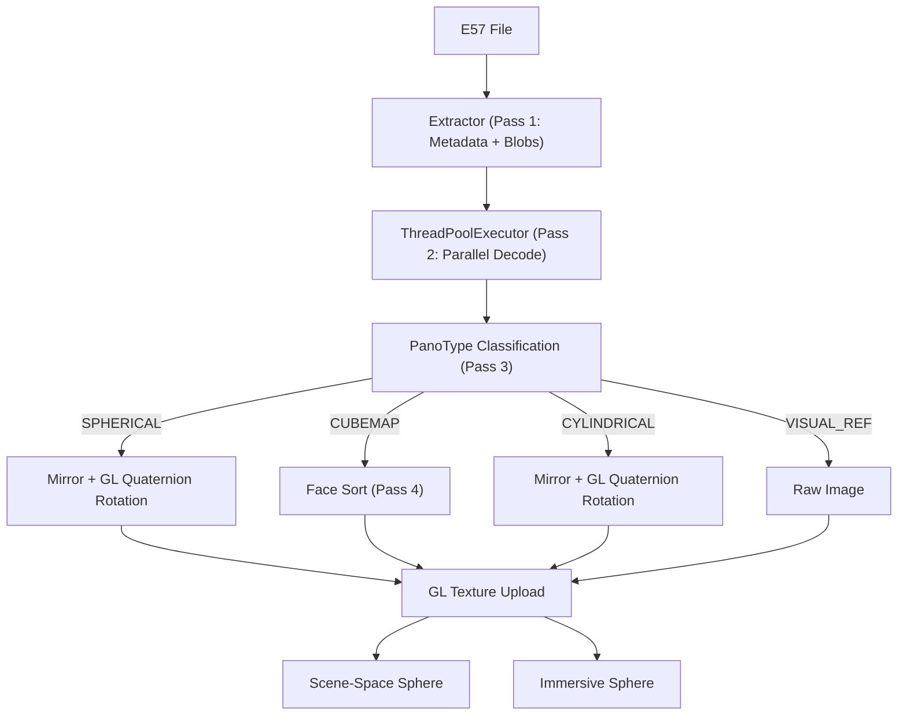
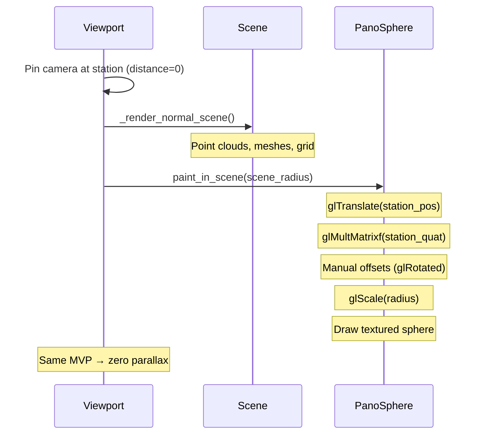
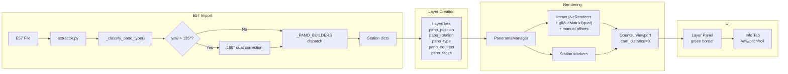

# Panorama Rendering Architecture

> Immersive 360° panorama visualization from E57 scan data.

---

## Overview

Locul3D extracts panorama images from E57 files, assembles them into equirectangular projections, and renders them as textured spheres in the 3D scene. The system supports multiple scanner formats (Leica BLK, NavVis, FARO) and two rendering modes.



---

## PanoType Enum & Dispatch

All panorama types are classified into a `PanoType` enum, then dispatched to a dedicated builder via a single dict lookup:

```python
class PanoType(Enum):
    SPHERICAL   = "spherical"     # NavVis, FARO
    CUBEMAP     = "cubemap"       # Leica BLK
    CYLINDRICAL = "cylindrical"   # Older scanners
    VISUAL_REF  = "visual_ref"    # Overview photos

# E57 rep key → PanoType
_REP_KEY_MAP = {
    "sphericalRepresentation":        PanoType.SPHERICAL,
    "pinholeRepresentation":          PanoType.CUBEMAP,
    "cylindricalRepresentation":      PanoType.CYLINDRICAL,
    "visualReferenceRepresentation":  PanoType.VISUAL_REF,
}

# Dispatch: classify once, look up builder
pano_type = _classify_pano_type(imgs)
station = _PANO_BUILDERS[pano_type](idx, imgs, pos, quat)
```

For direct blobs (no representation node), a heuristic selects the type: wide aspect → spherical, 6+ images → cubemap, otherwise visual ref.

---

## E57 Image Formats

| PanoType | E57 Representation | Scanner Examples | Processing |
|----------|-------------------|------------------|------------|
| `SPHERICAL` | `sphericalRepresentation` | NavVis VLX, FARO | Mirror + GL quaternion |
| `CUBEMAP` | `pinholeRepresentation` | Leica BLK2GO/360 | Face sort by quaternion |
| `CYLINDRICAL` | `cylindricalRepresentation` | Older scanners | Mirror + GL quaternion |
| `VISUAL_REF` | `visualReferenceRepresentation` | Various | Raw image (no transform) |

### Spherical Pipeline

```
E57 sphericalRepresentation → JPEG/PNG blob → PIL Image
    → Mirror (FLIP_LEFT_RIGHT for inside-out sphere UV)
    → GL texture upload
    → Station quaternion rotation via glMultMatrixf at render time
    → Manual fine-tuning offsets (interactive keyboard adjustment)
```

The station quaternion encodes the scanner's orientation in world coordinates. The **full quaternion** (yaw + pitch + roll) is converted to a 4×4 rotation matrix (conjugate, since we rotate the sphere inversely) and applied via `glMultMatrixf`. Manual fine-tuning offsets are applied on top via `glRotated`.

### Cubemap Pipeline

```
E57 pinholeRepresentation × 6 faces → JPEG/PNG blobs → PIL Images
    → Sort faces by quaternion look-direction into standard slots
    → Assemble into equirectangular projection
    → No GL rotation needed (face sorting already world-aligned)
```

#### Face Sorting

Each face's quaternion computes a world-space look direction by rotating `[0,0,1]` (E57 local camera +Z). The dominant axis maps to a cubemap slot:

```
Slot 0: +X    Slot 1: -X
Slot 2: +Y    Slot 3: -Y
Slot 4: +Z    Slot 5: -Z
```

> **Z-axis swap**: Slots 4/5 are intentionally swapped to correct for pinhole image inversion on vertical faces.

#### Equirectangular Assembly

For each output pixel `(u, v)`:

1. Convert to spherical: `θ = u·2π - π`, `φ = π/2 - v·π`
2. Convert to 3D direction: `(cos(φ)cos(θ), cos(φ)sin(θ), sin(φ))`
3. Determine dominant cubemap face from direction
4. Compute face UV coordinates
5. Sample from face image

---

## Orientation Alignment

### The Problem

Spherical/cylindrical panoramas are stored in the scanner's **local frame**. The station quaternion `(w, x, y, z)` rotates local → world. Without applying this rotation, the panorama is misaligned in yaw, pitch, and roll.

### Multi-Pass Parallel Extraction

To ensure high performance when loading hundreds of panoramas, the extraction process is split into four passes:

1.  **Pass 1 (Sequential)**: Read E57 metadata and raw JPEG/PNG blobs into memory. Sequential reading is required as the underlying E57 file handle is not thread-safe.
2.  **Pass 2 (Parallel)**: Use a `ThreadPoolExecutor` to decode images using PIL and apply the horizontal mirror in parallel across all CPU cores.
3.  **Pass 3 (Sequential)**: Group processed images by position into station records.
4.  **Pass 4 (Sequential)**: Build final station dictionaries using type-specific dispatch (e.g., stitching cubemap faces). Apply 180° yaw auto-correction where needed.

This multi-pass architecture reduces the loading time for 100 panoramas from ~80s to ~15s on an 8-core machine.

### GL Quaternion Rotation (Current Approach)

The station quaternion is applied as a full 3-axis GL rotation at render time:

```python
@staticmethod
def _quat_to_gl_matrix(quat):
    w, x, y, z = quat
    x, y, z = -x, -y, -z  # conjugate (inverse rotation)
    return np.array([
        1-2*(y*y+z*z), 2*(x*y+w*z),   2*(x*z-w*y),   0,
        2*(x*y-w*z),   1-2*(x*x+z*z), 2*(y*z+w*x),   0,
        2*(x*z+w*y),   2*(y*z-w*x),   1-2*(x*x+y*y), 0,
        0,             0,             0,             1,
    ], dtype=np.float32)
```

Applied per-type:
- **Spherical/Cylindrical**: quaternion rotation applied (image in scanner-local frame)
- **Cubemap**: no rotation (face sorting already produces world-aligned equirect)
- **Visual Ref**: no rotation (overview photos, no alignment expected)

### 180° Yaw Auto-Correction

Some panoramas have quaternions with `|yaw| > 135°`. These panoramas appear 180° flipped after the standard conjugate rotation. This is caused by the equirectangular image having a different internal azimuth reference direction compared to the majority of images.

**Detection**: During Pass 4, the yaw is extracted from the station quaternion:

```python
yaw = atan2(2·(w·z + x·y), 1 - 2·(y² + z²))
```

If `|yaw| > 135°`, the quaternion is multiplied by a 180° Z-axis rotation:

```python
# q × (0,0,0,1) = (-z, y, -x, w)
quat = (-z, y, -x, w)
```

Console output: `⚠ Panorama N: |yaw|=176.2° > 135° — applying 180° yaw correction`

### Why Not Image-Level Transforms?

- **Pixel shift** (`np.roll`): handles yaw only, misses pitch/roll entirely
- **Roll via pixel shift**: impossible — roll requires full 2D image rotation
- **Image-level rotation**: expensive for 32MP images, introduces interpolation artifacts
- **GL rotation**: exact, zero-cost, handles all three axes in one matrix multiply

### Residual Alignment Error

After GL quaternion rotation + 180° auto-correction, a per-panorama residual of **~3–8°** remains. Interactive fine-tuning confirms this residual is **consistent across all 360° viewing angles** within a single panorama, proving the quaternion rotation handles all 3 axes correctly.

| Observation | Value | Cause |
|-------------|-------|-------|
| Yaw residual | ±4–8° | Varies per panorama, sign inconsistent |
| Pitch residual | ±1–7° | Slightly higher for 180°-corrected panoramas |
| Roll residual | ±1–5° | Varies per panorama |
| View-angle consistency | ✓ Fully consistent | GL rotation handles all 3 axes |

**Probable causes** of residual:
1. E57 ↔ GL coordinate frame mapping has a small systematic offset
2. NavVis 4-camera stitching introduces per-camera calibration error
3. The E57 `sphericalRepresentation` has no `horizontalStartAngle` field (confirmed absent in NavVis exports)

### Interactive Fine-Tuning

Keyboard controls for real-time manual alignment in panorama mode:

| Key | Action | Step |
|-----|--------|------|
| Arrows / WASD | Yaw and Pitch | 0.1° |
| Shift + Arrows / WASD | Yaw and Pitch | 1.0° |
| Q / E | Roll | 0.1° (Shift: 1.0°) |
| R | Reset all offsets | — |

Current correction is printed to console:
```
Fine-tuning correction: yaw=-5.7°, pitch=+2.2°, roll=-4.3°
```

---

## Zero-Parallax Camera

In panorama mode, the camera is pinned **exactly** at the station position:

```python
self.cam_target = station_position
self.cam_distance = 0.0  # eye == station center
```

With `cam_distance = 0.0`, `gluLookAt` uses a synthesized look-at point from the view direction:

```python
if self.cam_distance < 0.001:
    # eye == target → compute look-at from view direction
    look = eye - view_direction
else:
    look = target
```

This eliminates both translational and angular parallax between the panorama texture and the point cloud.

---

## Rendering Modes

### Scene-Space Mode (See-Through)

When panorama opacity < 100%, the sphere is rendered as a **scene object** alongside the point cloud, using the same camera and projection matrix.



**Camera behavior:**
- Normal orbit controls (left-drag = azimuth/elevation)
- Scroll = dolly (normal behavior)
- Layer visibility hides/shows the sphere independently

### Immersive Mode (Full Opacity)

When opacity = 100%, a fast origin-based renderer draws the sphere from `(0,0,0)` with a tight near/far range. No scene geometry is rendered.

---

## Sphere Geometry

The inside-out UV sphere is generated by `geometry.py`:

```
Latitude:   0..π  (north pole → south pole)
Longitude:  0..2π (full revolution)

Vertex: (sin(θ)cos(φ), sin(θ)sin(φ), cos(θ))
UV:     (lon/n_lon, lat/n_lat)
```

Inside-out winding ensures correct rendering when the camera is inside the sphere.

---

## Station Markers & UI

### Markers
When inside a panorama:
- **Active station**: rendered with full layer color
- **Inactive stations**: rendered **gray at 30% opacity**

### Layer Panel
- Click **360°** button → `pano_requested` signal → `enter_panorama()`
- Active row gets a **green border highlight**
- **Esc** → `exit_panorama()` → clear highlight

### Info Tab
Shows panorama metadata when selected:
- Station position (X, Y, Z)
- Quaternion and Euler angles (Yaw, Pitch, Roll)
- Panorama type, image dimensions, cubemap face info

---

## Module Structure

```
rendering/panorama/
├── __init__.py        PanoramaManager — orchestration, equirect assembly, keyboard fine-tuning
├── camera.py          CameraIntrinsics, CameraPose, projection utilities
├── extractor.py       E57 extraction, PanoType enum, face sorting, builders, 180° auto-detect
├── geometry.py        UV sphere mesh generation
├── immersive.py       ImmersiveRenderer — GL texture, sphere, quat rotation matrix
└── station_marker.py  Diamond marker rendering
```

---

## Data Flow



---

## Scanner-Specific Notes

### Leica BLK2GO / BLK360
- **PanoType**: `CUBEMAP` (6 pinhole faces per station)
- **Quaternion**: per-face — used for face sorting, no GL rotation needed
- **Face size**: typically 1024×1024 or 2048×2048

### NavVis VLX
- **PanoType**: `SPHERICAL` (pre-stitched equirectangular from 4 cameras at 90° intervals)
- **Image size**: 8192×4096 (pixelWidth = 0.000767 rad/px, full 360°)
- **GL rotation**: full conjugate quaternion applied via `glMultMatrixf`
- **Per-camera stitching**: 4 cameras produce per-quadrant
- **E57 metadata**: only `imageWidth`, `imageHeight`, `pixelWidth`, `pixelHeight` — no `horizontalStartAngle`

### FARO Focus
- **PanoType**: `SPHERICAL` (equirectangular)
- **Image size**: varies (up to 10000×5000)
- **GL rotation**: full quaternion applied
