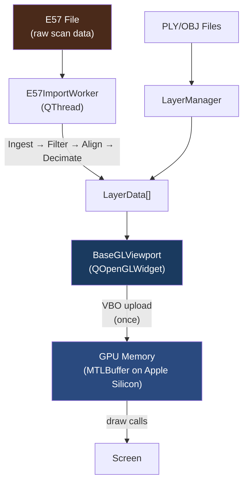
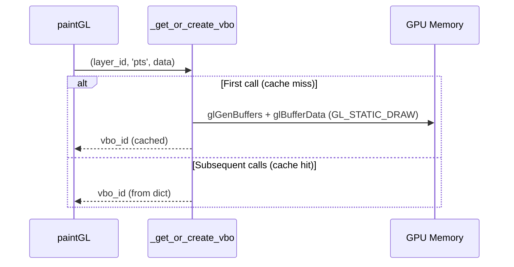
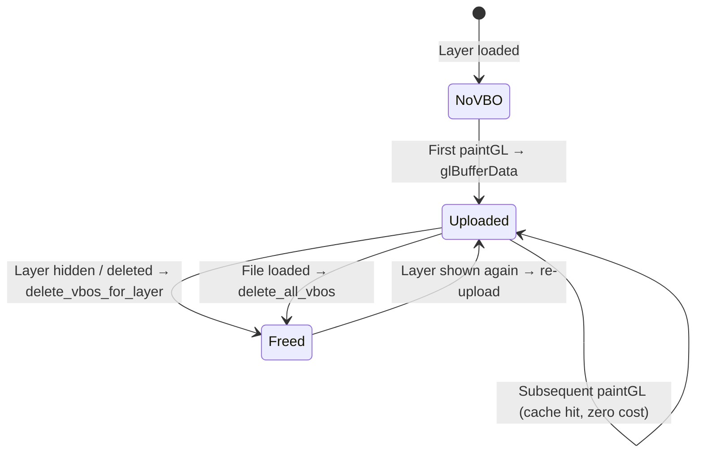
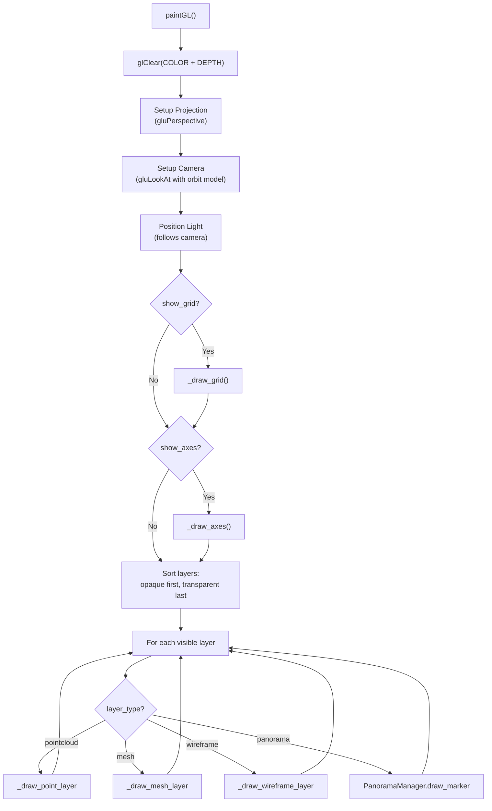
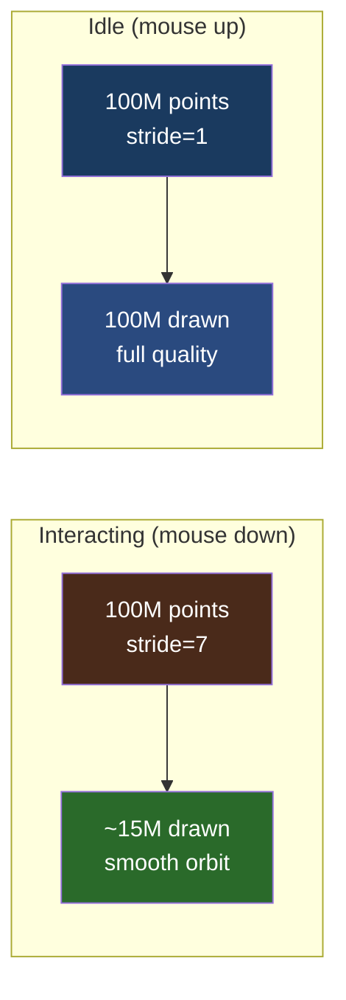
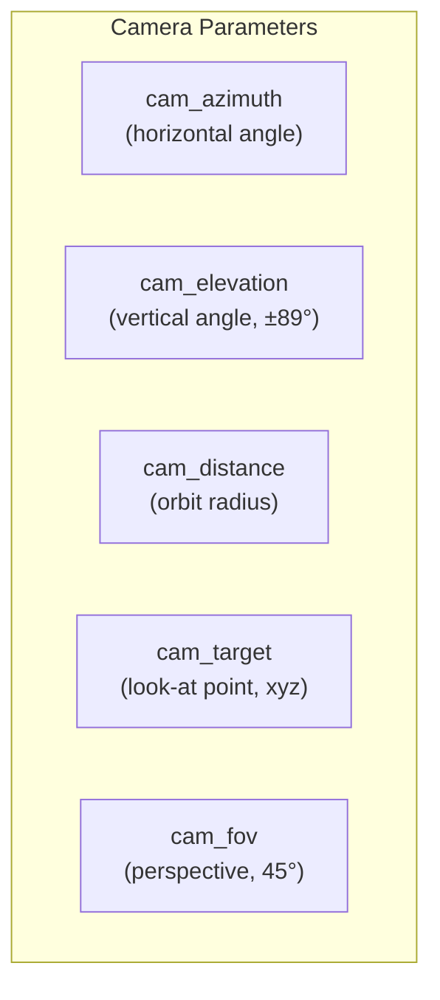

# Rendering Pipeline

> Architecture and optimizations for large-scale point cloud, mesh, and wireframe rendering in Locul3D.

## Overview

Locul3D renders 3D scan data (point clouds up to 100M+ points, triangle meshes, wireframes) using an OpenGL 2.1 fixed-function pipeline exposed through PyOpenGL and PySide6's `QOpenGLWidget`. On macOS, the actual GPU work runs on Metal via Apple's automatic translation layer.



## Architecture Layers

```
┌──────────────────────────────────────────────────────────┐
│  UI Layer                                                │
│  ┌────────────┐  ┌────────────┐  ┌────────────┐          │
│  │ LayerPanel │  │ InfoPanel  │  │ BBoxPanel  │ ..panels │
│  └────────────┘  └────────────┘  └────────────┘          │
├──────────────────────────────────────────────────────────┤
│  Rendering Layer                                         │
│  ┌─────────────────────────────────────────────────────┐ │
│  │ BaseGLViewport  (shared by editor + viewer)         │ │
│  │  ├─ VBO Manager  (_get_or_create_vbo / delete)      │ │
│  │  ├─ Camera       (orbit, pan, dolly, fit-to-scene)  │ │
│  │  ├─ Scene Helpers (grid, axes)                      │ │
│  │  └─ Layer Renderers                                 │ │
│  │      ├─ _draw_point_layer   (VBO + stride LOD)      │ │
│  │      ├─ _draw_mesh_layer    (VBO + index buffer)    │ │
│  │      └─ _draw_wireframe_layer (VBO)                 │ │
│  └─────────────────────────────────────────────────────┘ │
├──────────────────────────────────────────────────────────┤
│  Data Layer                                              │
│  ┌──────────────────────────────────────────────────────┐│
│  │ LayerManager                                         ││
│  │  └─ LayerData[]                                      ││
│  │      ├─ points    Nx3 float32                        ││
│  │      ├─ colors    Nx3 float32 (RGB)                  ││
│  │      ├─ normals   Nx3 float32                        ││
│  │      ├─ triangles Mx3 uint32                         ││
│  │      └─ line_points Lx3 float32                      ││
│  └──────────────────────────────────────────────────────┘│
└──────────────────────────────────────────────────────────┘
```

## Editor vs Viewer

Both the Editor and Viewer use the same `BaseGLViewport` class:

| Component | Editor | Viewer |
|---|---|---|
| GL Widget | `editor/viewport.py` → subclass of `BaseGLViewport` | `viewer/window.py` → uses `BaseGLViewport` directly |
| Window | `editor/window.py` (full IDE: panels, menus, tabs) | `viewer/window.py` (minimal: render + layer panel) |
| Data | `LayerManager` (shared) | `LayerManager` (shared) |
| Rendering | Identical (inherited from `BaseGLViewport`) | Identical |

---

## VBO Management

### Upload Strategy

Data is uploaded to the GPU **once** via `_get_or_create_vbo()` and cached by `(layer_id, buffer_kind)`:



### Buffer Kinds

Each layer can have up to 4 VBOs:

| Kind | Data | dtype | Usage |
|---|---|---|---|
| `pts` | Vertex positions | `float32` Nx3 | `GL_ARRAY_BUFFER` → `glVertexPointer(3)` |
| `rgb` | Vertex colors | `float32` Nx3 | `GL_ARRAY_BUFFER` → `glColorPointer(3)` |
| `normals` | Surface normals | `float32` Nx3 | `GL_ARRAY_BUFFER` → `glNormalPointer` |
| `tris` | Triangle indices | `uint32` Mx3 | `GL_ELEMENT_ARRAY_BUFFER` → `glDrawElements` |
| `lines` | Wireframe verts | `float32` Lx3 | `GL_ARRAY_BUFFER` → `glDrawArrays(GL_LINES)` |

### VBO Lifecycle



### Apple Silicon UMA Optimization

On Apple Silicon, the OpenGL→Metal translation layer maps `glBufferData(GL_STATIC_DRAW)` to a `MTLBuffer` with **shared storage**. This means:

- The CPU and GPU share the same physical RAM (Unified Memory Architecture)
- No DMA copy between CPU and GPU address spaces
- The "upload" is effectively a pointer registration, not a data transfer
- Subsequent draws read directly from the shared buffer

---

## Rendering Flow

### Per-Frame Pipeline



### Layer Draw Order

Layers are sorted for correct transparency:

1. **Opaque layers** (`opacity ≥ 0.99`) — rendered first with standard depth testing
2. **Transparent layers** (`opacity < 0.99`) — rendered second with `GL_CONSTANT_ALPHA` blending

---

## Optimizations

### 1. Stride-Based LOD (Level of Detail)

**Problem**: Drawing 100M+ points every frame through PyOpenGL's GL→Metal translation layer yields <1 FPS, making orbit/pan unusable.

**Solution**: While the mouse is held down (`_interacting=True`), increase the `glVertexPointer` stride so OpenGL reads every Nth vertex from the same VBO — no data copy, no second buffer.



```
MAX_INTERACTIVE_PTS = 15,000,000
stride = point_count // MAX_INTERACTIVE_PTS   (e.g. 100M / 15M ≈ 7)

glVertexPointer(3, GL_FLOAT, stride * 12, None)   # skip N vertices
glColorPointer(3, GL_FLOAT, stride * 12, None)     # same stride for colors
glDrawArrays(GL_POINTS, 0, point_count // stride)
```

### 2. GPU-Side Opacity (Zero-Cost Slider)

**Problem**: Baking opacity into per-vertex RGBA data requires regenerating a 1.6 GB array for 100M points every time the slider moves.

**Solution**: Upload RGB colors once (3-component, immutable). Apply opacity as a GPU blend state:

```
glBlendFunc(GL_CONSTANT_ALPHA, GL_ONE_MINUS_CONSTANT_ALPHA)
glBlendColor(0, 0, 0, layer.opacity)
```

This makes opacity changes **instant** regardless of dataset size — it's a single GL state change, not a data operation.

| Approach | Data per opacity change | 100M pts cost |
|---|---|---|
| ~~RGBA bake~~ | Regenerate Nx4 array + re-upload VBO | ~1.6 GB alloc + ~1s |
| **RGB + GL_CONSTANT_ALPHA** | Zero | ~0 ms |

### 3. Data Type Safety (float32 Enforcement)

**Problem**: E57 files load as `float64`. Passing `float64` data to `glVertexPointer(GL_FLOAT)` (which expects 32-bit) causes OpenGL to read past buffer boundaries → **SIGSEGV**.

**Solution**: All `get_*_array()` accessors in `LayerData` enforce both `float32` dtype **and** C-contiguity:

```python
def get_pts_array(self):
    if self.points.dtype != np.float32 or not self.points.flags['C_CONTIGUOUS']:
        self.points = np.ascontiguousarray(self.points, dtype=np.float32)
    return self.points
```

This conversion happens once (in-place) and is cached on the `LayerData` instance.

### 4. Zoom-Adaptive Point Size

For sparse layers (<100K points), point size scales with camera distance to maintain visual density when zoomed in:

```
ref_distance = scene_radius × 2.5
zoom_ratio   = ref_distance / cam_distance
zoom_scale   = clamp(zoom_ratio, 1.0, 10.0)
point_size   = base_size × zoom_scale
```

Dense layers (>100K points) keep a fixed point size to avoid visual bloat.

### 5. Small-Layer Overlay

Point clouds with <10K points (e.g., detected feature marker points) render with:
- Depth testing **disabled** — always visible over wireframes and meshes
- Enlarged point size (2.5× base) — better visibility for landmark features

---

## Panorama Rendering

Panorama support is a self-contained subpackage (`rendering/panorama/`) with four modules:

| Module | Purpose |
|---|---|
| `geometry.py` | Pure-function UV sphere mesh generation (inside-out winding) |
| `extractor.py` | E57 `images2D` extraction via libe57 (pinhole, spherical, cylindrical, cubemap) |
| `station_marker.py` | Configurable diamond gizmo at panorama camera positions |
| `immersive.py` | 360° inside-out textured sphere renderer |

`PanoramaManager` in `__init__.py` composes these modules. The viewport owns one instance and delegates all panorama work through it.

### Rendering Modes

**Scene mode** (normal): panorama layers render as diamond station markers at their recorded camera positions. Marker colour and opacity follow `layer.color` and `layer.opacity`, so toggling visibility hides the marker.

**Immersive mode** (entered via 360° button): the equirectangular image is texture-mapped onto an inside-out UV sphere (64×128 subdivisions). The camera sits at the sphere origin; mouse controls yaw/pitch, scroll adjusts FOV. Esc restores the previous camera state.

### Disabling Panorama Support

Remove `rendering/panorama/` and the `PanoramaManager` line in `viewport.py` `__init__`. The import is guarded by `try/except`, so the app runs without it.

---

## Camera Model

The viewport uses an **orbit camera** (azimuth/elevation around a target point):



| Input | Action |
|---|---|
| **Left drag** | Orbit (azimuth + elevation) |
| **Shift+Left drag** | Pan (translate target) |
| **Middle drag** | Pan |
| **Right drag** | Dolly (move through scene) |
| **Scroll wheel** | Dolly in/out |

---

## Memory Budget (100M Point Cloud Example)

| Buffer | Size | Stored In |
|---|---|---|
| Vertex positions (Nx3 float32) | 1,128 MB | GPU VBO `pts` |
| Vertex colors (Nx3 float32) | 1,128 MB | GPU VBO `rgb` |
| NumPy source arrays | ~2,256 MB | CPU RAM |
| **Total** | **~4.5 GB** | CPU + GPU (shared on UMA) |

On Apple Silicon with unified memory, the CPU and GPU share the same physical RAM, so the actual footprint is closer to ~2.3 GB (VBOs alias the numpy arrays in shared memory).

---

## File Reference

| File | Purpose |
|---|---|
| [`rendering/gl/viewport.py`](../../src/locul3d/rendering/gl/viewport.py) | `BaseGLViewport` — all rendering, VBO, camera |
| [`rendering/panorama/`](../../src/locul3d/rendering/panorama/) | Panorama subpackage (extractor, marker, immersive, geometry) |
| [`core/layer.py`](../../src/locul3d/core/layer.py) | `LayerData` (geometry + accessors), `LayerManager` |
| [`core/constants.py`](../../src/locul3d/core/constants.py) | Colors, layer groups, default sizes |
| [`editor/viewport.py`](../../src/locul3d/editor/viewport.py) | Editor viewport subclass |
| [`editor/window.py`](../../src/locul3d/editor/window.py) | Editor main window + E57 import orchestration |
| [`plugins/importers/e57.py`](../../src/locul3d/plugins/importers/e57.py) | E57 import pipeline (worker thread) |
| [`ui/widgets/layers.py`](../../src/locul3d/ui/widgets/layers.py) | Layer panel (visibility, opacity, color, panorama enter) |
